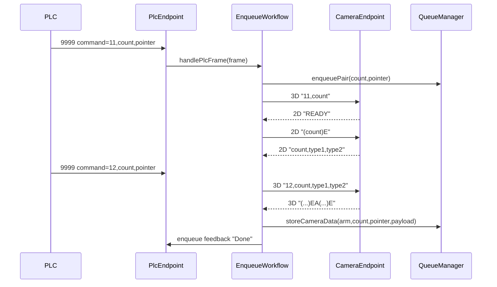

# camera-flow-parity design

## 0. 术语约定

| 术语 | 定义 | 防冲突结论 |
|---|---|---|
| 相机流程 parity | C++ 行为与旧 Python 入队/相机链路一致 | 不等同图像算法重写 |
| legacy 单相机 | 软件作为 TCP client 连接单相机，PLC 入队命令触发拍照，返回数据按顺序或 count 写队列 | 旧 `AsyncCameraHandler` |
| dual camera | 软件监听 `9001/9002`，2D/3D 相机作为 client 连接，PLC `11/12` 驱动流程 | 旧 `DualCameraServer` + `EnqueueWorkflowCoordinator` |
| 2D READY 窗口 | PLC `11` 到 `12` 之间允许接受一次 2D `READY` | `12` 到来后关闭窗口 |
| 3D 双臂帧 | 形如 `(...)EA(...)E` 的一组 arm1/arm2 数据 | 按 flag 千位分流 arm |
| 入队阶段反馈 | 软件通过 PLC 入队通道回 `Done` 等阶段文本 | 不等同出队 `XN/XD` |

## 1. 决策与约束

### 需求摘要

在已落地的 C++ 最小闭环上补齐相机入队链路：程序按配置支持 legacy 单相机和 dual camera 两种模式，PLC `9999` 入队帧仍由 `command,count,pointer` 驱动；相机 payload 写入 `QueueManager` 后，后续出队/fake robot 流程不用改。成功标准是用模拟 PLC/相机复现旧项目的 `11 -> 2D READY -> 12 -> 3D -> Done` 和 legacy 单相机入队路径。

明确不做：
- 不改变 PLC `9999/9090` 报文格式。
- 不改变 2D `READY`、`count,type1,type2` 和 3D `(...)EA(...)E` 外部格式。
- 不接真实 DUCO SDK，不改变 fake robot 出队闭环。
- 不做 Qt Widgets HMI，不做 Modbus。
- 不实现图像算法，只处理相机通讯帧和队列入库。

### 复杂度档位

走“工业通讯编排 parity”档位。偏离默认点：
- 并发 = 中：PLC、2D、3D 三路 socket 事件可能交错。
- 状态机 = 中：dual camera 需要按 count 维护 `11/12/READY/2D result/3D result/Done`。
- 兼容性 = 高：外部字节格式优先，不为了 C++ 内部简化改现场协议。

### 关键决策

1. **扩展现有模块，不重开主控**：继续使用 `Application`、`PlcEndpoint`、`QueueManager`，新增 `CameraEndpoint`、`CameraProtocol`、`EnqueueWorkflow`。
2. **协议解析集中在 protocol**：2D/3D 截帧、READY 识别、3D segment 分流放 `CameraProtocol`，避免散落到 socket 层。
3. **状态机集中在 core**：`EnqueueWorkflow` 负责 `11/12/READY/Done` 编排，`QueueManager` 只保存 payload。
4. **legacy 和 dual 通过配置切换**：默认配置可保留当前现场模式；两套流程共享 `QueueManager::storeCameraData()`。

### 前置依赖

`cpp-minimal-loop` 已 done，现有 C++ 具备 PLC `9999/9090`、队列核心、fake robot 和测试框架。

## 2. 名词与编排

### 2.1 名词层

#### 现状

- C++ 当前已有 `PlcEnqueueFrame`、`QueueManager::enqueuePair()`、`QueueManager::storeCameraData()`、`PlcEndpoint`。
- 旧 Python 参考：
  - `队列管理/src/core/enqueue_workflow.py`：dual camera `11/12/READY/Done` 状态机。
  - `队列管理/src/core/camera_server.py`：2D `9001`、3D `9002` 服务端。
  - `队列管理/src/core/camera_handler.py`：legacy 单相机 client 触发。
  - `队列管理/config/settings.py`：`enqueue_flow_mode`、`camera_correlation_mode`、端口和默认值配置。

#### 变化

- 新增相机配置：
  - `CameraConfig { host, camera2dPort, camera3dPort, camera3dEnabled, legacyHost, legacyPort, flowMode }`
- 新增相机协议值对象：
  - `CameraFrame { cameraKey, raw }`
  - `Parsed2dFrame { kind, count, partType }`
  - `Parsed3dSegment { armId, count, payload }`
- 新增入队流程状态：
  - `EnqueueCycle { count, pointer, readyReceived, endReceived, partType, armReady, doneSent }`

#### 接口示例

```cpp
parse2dFrame("READY") -> Parsed2dFrame{ kind=Ready }
parse2dFrame("10,01,02") -> Parsed2dFrame{ kind=Result, count=10, partType="01,02" }
split3dFrames("(1001,10,x)EA(2001,10,y)E") -> 1 frame
parse3dSegment("(1001,10,x)E") -> Parsed3dSegment{ armId=1, count=10 }
```

### 2.2 编排层



#### 现状

- `Application::wireEvents()` 目前把所有合法 PLC 入队帧直接 `enqueuePair(count,pointer)`。
- `QueueManager::storeCameraData()` 已能把 camera payload 写入既有队列项。
- 当前没有 `CameraEndpoint`，也没有 2D/3D 截帧或入队状态机。

#### 变化

- PLC 入队回调改为交给 `EnqueueWorkflow`，由流程模式决定 legacy/dual 行为。
- dual camera 模式按旧流程保留：
  - `11`：创建 cycle、成对入队、打开 2D READY 窗口、向 3D 发 `11,count`。
  - `READY`：窗口有效时向 2D 发 `(count)E`，重复 READY 忽略。
  - `12`：关闭 READY 窗口，向 3D 发 `12,count,type`；无 2D 类型时用 `00,00`。
  - 3D 双臂帧：按 arm 分流写队列；arm1/arm2 都就绪后回 `Done`。
- legacy 单相机模式保留单相机 client 触发，并按配置选择 sequential/count 匹配队列项。

#### 流程级约束

- 相机 socket 回调不执行阻塞动作；只解析、入事件和触发状态机。
- `12` 到来不等待 2D；晚到 2D 结果按配置丢弃。
- `Done` 对同一 count 只发送一次，且必须 arm1/arm2 都有 3D payload。
- 3D 半包必须留在缓冲区，不能提前消费。
- 相机未连接只记录 WARN 并保持 PLC 线程可继续处理。

### 2.3 挂载点清单

- `config/default.toml`：新增 camera 与 `enqueue_flow_mode` 配置。
- `Application` PLC 入队分发：从直接 `enqueuePair()` 改为调用 `EnqueueWorkflow`。
- `CameraEndpoint` 启动注册：按配置启动 legacy client 或 dual `9001/9002`。
- `EnqueueWorkflow`：新增入队相机状态机和 PLC 入队阶段反馈。
- `CameraProtocol`：新增 2D/3D 截帧和解析契约。

### 2.4 推进策略

1. 结构微重构：拆分 `Application::wireEvents()` 中 PLC 入队/出队连接逻辑。
   退出信号：现有 `spray_tests` 仍全绿，行为零变化。
2. 相机协议节点：实现 2D READY/result、3D 双臂帧截取和 segment 分流。
   退出信号：协议测试覆盖 READY、CSV、括号 E、半包、多帧和非法 segment。
3. CameraEndpoint 通讯骨架：实现 dual server 和 legacy client 的可测接口。
   退出信号：模拟相机可连接 `9001/9002` 并收发 payload。
4. EnqueueWorkflow 状态机：接入 `11/12/READY/3D/Done` 编排。
   退出信号：dual camera 集成测试复现正常、fallback、晚到、重复 READY。
5. legacy 单相机 parity：补触发、回包匹配和默认值策略。
   退出信号：legacy 单相机测试覆盖 sequential 与 counted 匹配。
6. 应用集成与观测：配置、日志、snapshot 合入。
   退出信号：端到端日志可按 count/pointer 追踪 PLC -> camera -> queue。

### 2.5 结构健康度与微重构

##### 评估

- 文件级：`src/app/Application.cpp` 已集中 PLC wiring、日志和服务组装，继续直接追加 camera wiring 会偏胖。
- 文件级：`src/core/QueueManager.cpp` 已 200+ 行，不能把相机状态机塞进 QueueManager。
- 目录级：`src/protocol`、`src/core`、`src/io` 已按 roadmap 分层，不需要重组目录。
- compound convention：未发现目录组织类 convention。

##### 结论：做微重构（拆函数）

实现前先把 `Application::wireEvents()` 拆为 PLC 入队、PLC 出队、诊断事件几个私有函数，只搬不改行为。验证方式：现有 `spray_tests` 全绿，再进入 camera 主体。

##### 超出范围的观察

- 旧 Python 同时保留 legacy 和 dual 两套流程，C++ 后续可能需要更完整的 recipe/现场配置模型；本 feature 只做相机流程 parity，不处理 recipe。

## 3. 验收契约

### 关键场景清单

1. dual 模式启动，配置 `camera2d_port=9001`、`camera3d_port=9002`。
   - 期望：两个相机端口监听成功，PLC `9999/9090` 保持可用。
2. PLC 发 `11,count=10,pointer=1`。
   - 期望：arm1/arm2 成对入队，3D 收到 `11,10`，2D READY 窗口打开。
3. 2D 发 `READY`。
   - 期望：软件向 2D 回 `(10)E`；重复 READY 不重复请求。
4. PLC 发 `12,count=10,pointer=1` 且已有 2D `10,01,02`。
   - 期望：3D 收到 `12,10,01,02`。
5. PLC 发 `12` 时没有 2D 类型。
   - 期望：3D 收到 `12,10,00,00`，晚到 2D 结果被丢弃。
6. 3D 发 `(1001,10,a)EA(2001,10,b)E`。
   - 期望：arm1/arm2 队列 payload 写入，PLC 入队通道收到 `Done`。
7. 3D 半包或非法 segment。
   - 期望：半包保留等待补齐，非法 segment 记录 WARN，进程不崩溃。
8. legacy 单相机模式。
   - 期望：不启动 `9001/9002` 双相机服务，按旧单相机触发和回包匹配写队列。

### 明确不做的反向核对项

- 不应改动 PLC `9999/9090` 字段顺序和出队反馈 `XN/XD`。
- 不应引入 DUCO SDK、Qt Widgets、Modbus。
- 不应在 `QueueManager` 中实现相机状态机。
- 不应让 PLC socket 回调阻塞等待相机返回。

## 4. 与项目级架构文档的关系

acceptance 阶段需要把以下现状归并回架构：

- `.codestable/architecture/ARCHITECTURE.md`：新增 camera-flow-parity 已落地说明。
- 可新增或更新 `architecture/protocol-camera.md`：记录 2D/3D/legacy 相机帧格式、端口和阶段反馈语义。
- requirement `camera-flow-parity` 从 draft 更新为 current。
