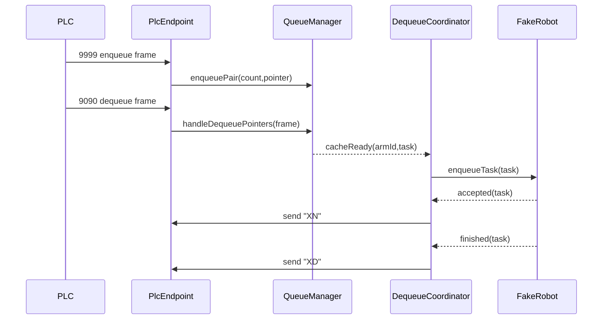

# cpp-minimal-loop design

## 0. 术语约定

| 术语 | 定义 | 防冲突结论 |
|---|---|---|
| 最小闭环 | 不接真实 DUCO、不接真实相机，先用 PLC 双端口、队列核心、fake robot 跑通出队反馈 | 与 roadmap `cpp-minimal-loop` 一致 |
| PLC 入队通道 | 软件监听 `9999`，PLC 发送 6 字节 `command,count,pointer` | 保留旧 Python 项目语义 |
| PLC 出队通道 | 软件监听 `9090`，PLC 发送 4 字节双指针，软件同通道回 `XN/XD` | 旧 README 里有 `9009` 写法，本项目以 `9090` 为准 |
| fake robot | C++ 内部仿真执行器，收到任务后延时产生 accepted/finished 事件 | 不等同旧机械臂 TCP `data/1` 客户端 |
| `XN/XD` | `X` 是 arm id；`N` 表示任务已接受并开始执行；`D` 表示任务结束 | 新项目不再等待机械臂发 `data/1` |

## 1. 决策与约束

### 需求摘要

为新 C++ 项目搭一条可运行的最小链路：程序启动后监听 PLC `9999/9090`，解析 PLC 入队与出队报文，维护 arm1/arm2 双队列和出队缓存，用 fake robot 模拟任务执行，并把 `1N/1D/2N/2D` 发回 PLC。成功标准是用模拟 PLC 发送一组入队和出队指针后，程序能稳定输出队列状态和 PLC 反馈。

明确不做：
- 不接真实新松 DUCO SDK。
- 不实现 Qt HMI 页面。
- 不实现相机 TCP 接入和 2D/3D 完整入队流程；可用测试/fixture 直接注入队列数据。
- 不实现 Modbus。
- 不改变 PLC `9999/9090` 报文字段和反馈码。

### 复杂度档位

走“工业通讯后端最小闭环”档位。偏离普通业务后端默认点：
- 并发 = 中：Qt socket 事件线程与 fake robot worker 之间有异步事件。
- 可观测性 = 中：必须记录原始 PLC 帧、队列事件、fake robot accepted/finished。
- UI = 暂无：本 feature 只保证 headless 可运行。

### 关键决策

1. **先 headless，后 HMI**：最小闭环使用 `QCoreApplication`，不创建 Widgets。HMI 后续通过 snapshot 接入，避免 UI 影响通讯稳定性判断。
2. **fake robot 替代 DUCO**：先验证队列和 PLC 反馈时序。DUCO SDK 的线程模型、心跳、上电使能放到后续 `duco-sdk-adapter`。
3. **出队即调度任务**：收到变化的出队指针并准备缓存后，`DequeueCoordinator` 立即向 fake robot 提交任务；fake robot accepted 后回 `XN`，finished 后回 `XD`。
4. **相机不进本闭环**：最小闭环提供测试注入或默认 payload 创建能力，不等待相机端口。相机 parity 后续单独做。

### 前置依赖

无。roadmap item `cpp-minimal-loop` 没有 `depends_on`。

## 2. 名词与编排

### 2.1 名词层

#### 现状

- 当前根目录没有 C++ 源码。
- 旧 Python 参考：
  - `队列管理/src/utils/data_parser.py`：`ParsedPLCEnqueueData`、`ParsedPLCDequeueData` 定义 PLC 报文。
  - `队列管理/src/core/queue_manager.py`：`ArmQueueItem`、`DequeueCache`、`EnhancedQueueManager` 承担双队列和出队缓存。
  - `队列管理/src/core/plc_handler.py`：`DualPortPLCHandler` 承担 `9999/9090` TCP 通道。

#### 变化

- 新增 C++ 协议值对象：
  - `PlcEnqueueFrame { command, count, pointer, extra }`
  - `PlcDequeueFrame { arm1Pointer, arm2Pointer }`
  - `FeedbackStage { Normal, Done }`
- 新增 C++ 队列实体：
  - `ArmQueueItem { armId, pointer, count, enqueueSeq, payload, status, source, sendCount, confirmed }`
  - `DequeueCache { armId, triggerPointer, selectedPointer, prefetchOffset, payload }`
- 新增 fake robot 任务：
  - `RobotTask { armId, count, pointer, payload, defaultNoop }`
  - `RobotTaskResult { taskId, armId, count, pointer, status, message }`

#### 接口示例

```cpp
// 来源：roadmap 4.1 / 4.2
parseEnqueueFrame(QByteArray::fromHex("0001000A0001"))
  -> PlcEnqueueFrame{ command=1, count=10, pointer=1 }

parseDequeueFrame(QByteArray::fromHex("00010000"))
  -> PlcDequeueFrame{ arm1Pointer=1, arm2Pointer=0 }

buildFeedback(1, FeedbackStage::Normal) -> QByteArray("1N")
buildFeedback(1, FeedbackStage::Done)   -> QByteArray("1D")
```

### 2.2 编排层



#### 现状

- 旧 Python 主编排在 `src/main.py`：PLC 入队回调解析后交给 queue manager；PLC 出队回调交给 `handle_dequeue_pointers()`；旧机械臂通过 TCP `data/1` 驱动 `XN/XD`。
- 旧项目 `XN` 在机械臂请求 data 并拿到 payload 后发送，`XD` 在机械臂完成确认后发送。

#### 变化

- C++ 最小闭环把机械臂请求阶段替换为 fake robot worker 事件：
  - `accepted` 触发 `XN`
  - `finished` 触发 `XD`
- `QueueManager` 不直接操作 socket；只发布 `cacheReady` / `taskStateChanged`。
- `PlcEndpoint` 只负责收发 TCP bytes；协议解析错误只记录并丢弃该帧，不阻塞监听。

#### 流程级约束

- 出队指针只有变化时才创建新任务；重复同一指针不重复发 `XN/XD`。
- `arm1Pointer=0` 或 `arm2Pointer=0` 视为该臂本帧不出队。
- fake robot 每个 arm 串行执行；同一 arm 新任务必须排队或拒绝，不能并发执行。
- PLC 反馈统一走 `9090` 当前有效连接；没有连接时记录 WARN，不让队列线程崩溃。
- 默认 payload 能跑通闭环，但必须标记 `defaultNoop=true`。

### 2.3 挂载点清单

- `CMakeLists.txt` — 新增主程序 target、测试 target、Qt Core/Network/Test 依赖。
- `config/default.toml` — 新增 PLC、queue、fake_robot、logging 的默认配置 key。
- 命令行入口 `spray_control --headless --simulate-robot` — 新增 headless 最小闭环启动方式。
- `PlcEndpoint` 端口注册 — 新增 `9999/9090` 两个监听端口。

### 2.4 推进策略

1. 项目骨架：建立 CMake/Qt Core 项目和 headless 入口。
   退出信号：程序启动后打印配置和监听端口。
2. 协议节点：实现 PLC 入队/出队解析和 feedback 编码。
   退出信号：协议单测覆盖正常帧、长度错误、重复反馈码。
3. 队列节点：实现成对入队、出队指针变化、缓存准备、默认 payload。
   退出信号：队列单测覆盖 arm1/arm2、重复指针、空指针。
4. 通讯骨架：接入 Qt TCP server，收发 `9999/9090` bytes。
   退出信号：模拟 PLC 能连接并看到 raw frame 日志。
5. fake robot 编排：出队缓存转任务，accepted/finished 回调驱动 `XN/XD`。
   退出信号：端到端测试收到 `1N -> 1D`。
6. 可观测性：补运行日志、事件历史和最小 snapshot。
   退出信号：一次闭环可在日志中按 count/pointer 追踪。

### 2.5 结构健康度与微重构

##### 评估

- 文件级 — 当前无 C++ 源码，不存在需要修改的胖文件；旧 Python 只读不改。
- 目录级 — 根目录只有 `.codestable/`、`队列管理/` 和 DUCO 文档，本次新增 `src/`、`tests/`、`config/`、`cmake/` 不会造成目录摊平。
- compound convention — `.codestable/compound` 为空，没有已有目录组织规约。

##### 结论：不做

本 feature 是全新 C++ 骨架，不做微重构。目录按 roadmap 的 app/protocol/core/io/robot/diagnostics 分层建立，避免把所有文件平铺到 `src/`。

##### 超出范围的观察

- 旧 Python `队列管理/README.md` 仍有 `9009` 旧端口表述，而配置和流程文档是 `9090`；本 feature 不修改旧项目文档。

## 3. 验收契约

### 关键场景清单

1. 启动 headless 程序，配置 `enqueue_port=9999`、`dequeue_port=9090`。
   - 期望：两个 TCP 端口监听成功，日志显示运行模式为 fake robot。
2. PLC 发送入队帧 `00 01 00 0A 00 01`。
   - 期望：arm1/arm2 创建 pointer=1、count=10 的队列项。
3. PLC 发送出队帧 `00 01 00 00`。
   - 期望：只为 arm1 创建任务，fake robot accepted 后 PLC 收到 `1N`，finished 后收到 `1D`。
4. PLC 重复发送相同出队帧 `00 01 00 00`。
   - 期望：不重复创建任务，不重复发送 `1N/1D`。
5. PLC 发送出队帧 `00 01 00 01`。
   - 期望：arm2 新增任务并回 `2N/2D`，arm1 不重复。
6. PLC 发送非法长度入队帧。
   - 期望：日志记录协议错误，程序继续监听。
7. `9090` 无 PLC 连接时 fake robot 完成任务。
   - 期望：日志记录反馈发送失败，进程不崩溃。

### 明确不做的反向核对项

- 代码中不应包含 `DucoCobot` 头文件 include 或 DUCO SDK 链接依赖。
- 不应创建 Qt Widgets 窗口类。
- 不应启动相机 `9001/9002` 监听端口。
- 不应包含 `QModbusTcpClient` 调用。
- `9999/9090` 报文字段顺序不应被改变。

## 4. 与项目级架构文档的关系

本 feature 会形成新项目的第一批“现状”：C++ 目录结构、PLC 双端口、协议值对象、队列状态机、fake robot 执行器、headless 启动方式。acceptance 阶段需要把这些提炼回：

- `.codestable/architecture/ARCHITECTURE.md`：更新模块索引和已落地现状。
- 后续可新增 `architecture/backend-core.md`：描述 PLC -> QueueManager -> FakeRobot -> PLC feedback 的最小闭环。
- 后续可新增 `architecture/protocol-plc.md`：记录 `9999/9090` 帧格式和 `XN/XD` 反馈语义。
