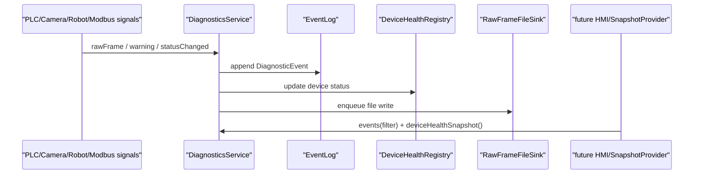

# diagnostics-and-logs design

## 0. 术语约定

| 术语 | 定义 | 防冲突结论 |
|---|---|---|
| DiagnosticEvent | 统一事件记录，覆盖业务事件、原始帧摘要、warning、错误码 | 扩展现有 `EventRecord`，不替代 Qt signal |
| RawFrameLog | PLC/相机/Modbus 原始通讯日志文件 | 不是控制台输出，不改变 socket 收发 |
| DeviceHealth | 设备健康快照，记录 online、连接数、最近收发和最近错误 | 对齐 HMI 设计里的 `DeviceSnapshot` |
| DiagnosticCode | 可 grep 的错误码字符串 | 不新增 PLC 反馈码，不改变 `XN/XD` |
| DiagnosticsService | 聚合事件、健康状态和文件 sink 的服务 | 从 `Application` wiring 中抽出诊断职责 |
| DeviceSimulator | 本地联调模拟器 | 用于测试/联调，不接管生产通讯 |

## 1. 决策与约束

需求摘要：本 feature 为现场联调建立诊断基础。成功标准是事件历史能按设备、count/pointer 和错误码追踪 PLC、相机、robot、Modbus 关键路径；原始通讯日志可持久化；设备健康状态可被后续 HMI 读取；本地模拟器能复现最小 PLC 闭环和 dual camera 入队流程。

明确不做：
- 不修改 PLC `9999/9090` 报文字段、相机 `9001/9002`/legacy 流程、DUCO motion 语义或 Modbus API。
- 不新增 Qt HMI 页面，不实现日志表格 UI。
- 不做真实硬件验收 checklist，不替代 `hardware-acceptance`。
- 不把高频 raw frame 同步写文件放在 socket 回调里阻塞通讯。
- 不新增新的 PLC 错误反馈码；错误码只用于软件诊断日志。

复杂度档位偏离：
- 健壮性 = L3：诊断系统不能因为日志写入失败影响主控通讯；失败必须降级为内存事件。
- 性能 = budgeted：raw frame 可能高频，内存事件要有上限，文件写入要异步或批量 flush。
- 可观测性 = logged：所有设备边界、状态变化和错误都要能留下可检索事件。
- 可测试性 = tested：事件过滤、健康快照、文件 sink 和模拟器需要单元/集成测试。
- 兼容性 = backward-compatible：现有 PLC、相机、DUCO、Modbus 流程保持兼容。

关键决策：
1. **诊断集中但流程不集中**：`DiagnosticsService` 只收集事件和健康状态，不接管 PLC/相机/robot 的业务编排。
2. **事件 schema 先行**：先统一 `DiagnosticEvent` 和 `DiagnosticCode`，再接入文件日志和健康快照。
3. **raw frame 持久化可配置**：默认保留内存事件，文件日志按 `[logging]` 开关控制，避免调试量过大影响现场运行。
4. **健康状态来自信号和快照**：PLC/相机连接数、rawFrame、warning、robot status、Modbus warning 都更新 `DeviceHealthRegistry`。
5. **模拟器走独立工具/测试支持**：模拟器只作为本地验证入口，不嵌入生产主控流程。

前置依赖：`cpp-minimal-loop`、`camera-flow-parity` 已 done；现有 `EventLog`、`rawFrame`、`warning`、`QueueSnapshot` 可作为输入。

## 2. 名词与编排

### 2.1 名词层

现状：
- `src/diagnostics/EventLog.h/.cpp` 只有 `EventRecord{timestamp,level,category,message}` 和内存 `append/records`。
- `Application` 在 `wireDiagnosticEvents()`、`wireCameraEvents()`、`wireDequeueCoordinatorEvents()` 中直接写 `eventLog_`。
- `PlcEndpoint`、`CameraEndpoint` 已发 `rawFrame` 和 `warning`；`IRobotController` 已发 `warning/statusChanged`；`PlcModbusClient` 已发 `warning`。
- `domain/Snapshots.h` 只有队列快照，没有设备健康快照。
- 当前无持久化日志 sink、错误码、日志过滤、模拟器 target。

变化：
- 新增 `DiagnosticEvent`：timestamp、level、category、device、direction、payloadHex、count、pointer、code、message。
- 新增 `EventFilter`：按 level、category、device、count、pointer、时间窗口过滤内存事件。
- 扩展 `EventLog`：支持 bounded ring buffer、`append(DiagnosticEvent)`、`query(filter)`、`clear()`。
- 新增 `DiagnosticCode`：用字符串或轻量 enum 表达 `PLC_PROTOCOL_INVALID_FRAME`、`CAMERA_NOT_CONNECTED`、`ROBOT_FAULT`、`MODBUS_ERROR` 等。
- 新增 `DeviceHealth` / `DeviceHealthRegistry`：记录设备 online、connectionCount、lastRxAt、lastTxAt、lastErrorAt、lastError。
- 新增 `DiagnosticsService`：统一接收 rawFrame/warning/status，写内存事件、更新健康状态、转发到 file sink。
- 新增 `RawFrameFileSink`：按配置把 raw frame 和事件写入 JSONL/文本日志文件。
- 新增 `DeviceSimulator`：提供 PLC enqueue/dequeue、dual camera READY/2D/3D、本地 fake robot 闭环的可测模拟入口。

接口示例：

```cpp
diagnostics.recordRawFrame("plc.enqueue", "rx", bytes, {count, pointer});
eventLog.query(EventFilter{.device = "plc", .count = 10});
healthRegistry.snapshot("camera.3d");
simulator.runDualCameraCycle(10, 1);
```

### 2.2 编排层



现状：
- `Application` 直接把各类 signal 转成 `EventLog::append(level,category,message)`。
- raw frame 日志只有内存事件，格式是 hex 字符串；没有文件 sink 和健康汇总。
- 测试通过 `QTcpSocket` 临时模拟 PLC/相机，没有统一模拟器。

变化：
- `Application` 创建 `DiagnosticsService`，把 PLC/camera/robot/Modbus 信号统一连到 diagnostics。
- `DiagnosticsService` 内部同步更新内存 ring buffer 和健康状态；文件写入通过队列/QTimer flush，避免阻塞设备回调。
- `Application` 对外暴露 `events(filter)`、`deviceHealthSnapshot()`，后续 HMI 只读这些快照。
- 模拟器通过独立 target 或测试支持类连接本地端口，复用现有协议 bytes，不绕过真实 endpoint。

流程级约束：
- diagnostics 失败不得让主控 start/stop、socket 回调或 robot worker 失败。
- raw frame 日志必须可关闭；关闭后仍保留关键 warning/error 内存事件。
- 内存事件有容量上限，超出按最旧事件丢弃，并记录一次 dropped 计数事件。
- 文件日志必须包含时间、设备、方向、hex payload 和消息，便于现场发回分析。
- 模拟器只能连接公开 TCP 端口或 fake seam，不直接访问 `QueueManager` 私有容器。

### 2.3 挂载点清单

- 配置挂载：`[logging]` 增加 log_dir、persist_raw_frames、persist_events、max_in_memory_events、flush_interval_ms。
- 应用诊断挂载：`Application` 用 `DiagnosticsService` 替代分散 `eventLog_.append` wiring。
- 快照挂载：`Application` / domain snapshot 增加 events(filter) 和 device health 只读入口。
- 文件日志挂载：新增日志目录和 raw/event 文件 sink，删掉后持久化诊断消失。
- 模拟器挂载：CMake 增加本地 simulator target 或 tests/support 入口，删掉后本地复现工具消失。

### 2.4 推进策略

1. 事件契约：定义 `DiagnosticEvent`、`EventFilter`、`DiagnosticCode` 和 bounded `EventLog`。
   退出信号：单测覆盖 append、过滤、容量上限和 dropped 计数。
2. 诊断服务骨架：建立 `DiagnosticsService` 和 `DeviceHealthRegistry`，先接内存事件和健康状态。
   退出信号：PLC/camera/robot warning/rawFrame 能更新事件和 health。
3. 文件 sink：接入可配置 raw/event 持久化，写入失败降级为 warning。
   退出信号：临时目录测试能看到 JSONL/文本日志，关闭开关后不写文件。
4. 应用集成：替换 `Application` 分散 event wiring，暴露 events(filter) 和 device health snapshot。
   退出信号：现有 application loop 测试仍能看到关键事件，PLC/相机流程不变。
5. 模拟器：实现本地 PLC/相机模拟入口，复现最小出队闭环和 dual camera 入队。
   退出信号：模拟器集成测试生成可检索事件日志。
6. 范围守护：复跑现有测试并 grep 外部协议路径。
   退出信号：`9999/9090`、camera、DUCO、Modbus 行为无协议变更。

### 2.5 结构健康度与微重构

##### 评估

- 文件级 — `src/app/Application.cpp`：已承担服务创建、生命周期、PLC/camera/robot wiring 和事件记录；本 feature 会继续命中多处事件 wiring。
- 文件级 — `src/diagnostics/EventLog.*`：当前很小，职责单一，适合扩展为事件存储，但不应承载文件 sink 和健康 registry。
- 文件级 — `src/domain/Snapshots.h`：当前仅队列快照，适合新增轻量 `DeviceHealthSnapshot`，不放日志查询逻辑。
- 目录级 — `src/diagnostics` 目前 2 个文件，本次新增 service/sink/health/code 仍适合该目录，不需要重组。
- 目录级 — `tests` 已有 28 个同层文件，但项目既有测试都平铺；本 feature 可先新增同级 diagnostics 测试，不在本轮做目录重组。
- compound convention：`.codestable/compound` 无目录组织类 decision。

##### 结论：不做预置微重构，新职责落新文件

本 feature 不先做单独微重构。实现时把 diagnostics 新职责落到 `src/diagnostics` 新文件；`Application.cpp` 只把现有 signal 连接目标从 `eventLog_` 迁到 `DiagnosticsService`，不在其中追加日志计算细节。

##### 超出范围的观察

- `tests/` 已经平铺较多文件，后续若继续增加设备级集成测试，可另走 `cs-refactor` 评估 `tests/support` 和按模块分组。

## 3. 验收契约

关键场景清单：
1. PLC raw frame：PLC 发送合法入队和出队帧。
   - 期望：事件历史和 raw 日志包含 device、direction、hex payload、count/pointer。
2. 协议错误：PLC 或相机发送非法帧。
   - 期望：事件包含 `DiagnosticCode`，进程继续监听。
3. 设备健康：PLC、2D、3D、robot、Modbus 出现连接、收发、warning。
   - 期望：health snapshot 更新 online、connectionCount、lastRx/lastTx、lastError。
4. 文件日志：开启持久化并运行一次最小闭环。
   - 期望：日志目录生成 raw/event 文件；关闭开关时不生成 raw 文件。
5. 容量上限：产生超过 max_in_memory_events 的事件。
   - 期望：旧事件被丢弃，dropped 计数可观察。
6. 模拟器最小闭环：本地模拟 PLC 入队和出队。
   - 期望：PLC 收到 `1N/1D`，日志能按 count/pointer 串起 enqueue、dequeue、robot、feedback。
7. 模拟器 dual camera：本地模拟 `11 -> READY -> 12 -> 3D -> Done`。
   - 期望：队列写入 camera payload，PLC 入队通道收到 `Done`，日志链路完整。

明确不做的反向核对项：
- 不应修改 PLC `9999/9090` 字节格式、反馈码或端口默认值。
- 不应修改相机 READY/2D/3D/Done 外部协议。
- 不应让 diagnostics 调用 `QueueManager` 写接口或触发 DUCO motion。
- 不应新增 Qt Widgets 页面或 HMI 日志模型。
- 不应在 socket 回调中直接做阻塞文件写入。

## 4. 与项目级架构文档的关系

acceptance 阶段需要回写：
- `ARCHITECTURE.md` 的术语：补入 DiagnosticEvent、DiagnosticsService、DeviceHealth、RawFrameLog、DeviceSimulator。
- `ARCHITECTURE.md` 的 diagnostics 子系统现状：说明事件历史、原始日志、健康快照和模拟器的边界。
- requirement `diagnostics-and-logs` 从 draft 更新为 current。
- roadmap item `diagnostics-and-logs` 从 in-progress 更新为 done。
