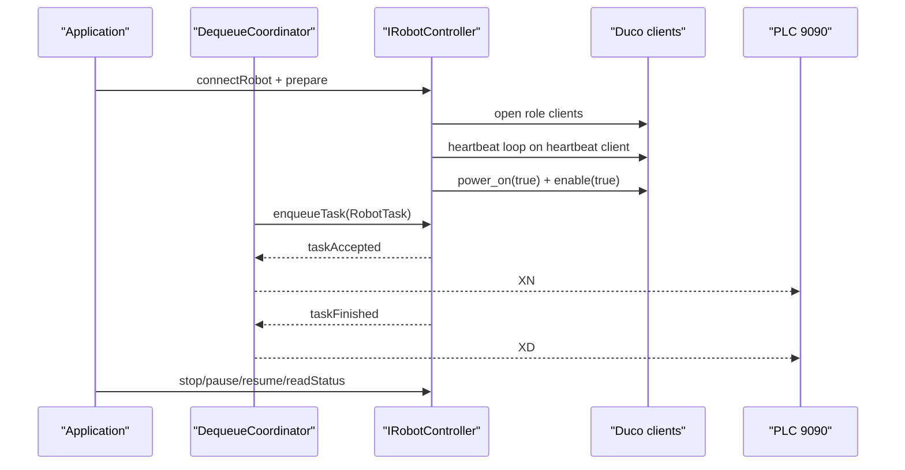

# duco-sdk-adapter design

## 0. 术语约定

| 术语 | 定义 | 防冲突结论 |
|---|---|---|
| `IRobotController` | `core::DequeueCoordinator` 面向的统一机械臂控制契约 | roadmap 已使用该名；当前代码尚无实现 |
| fake robot | 现有 `robot::FakeRobotController`，用 timer 模拟 accepted/finished | 继续作为测试和无 SDK 环境的默认实现 |
| DUCO controller | 基于 `DucoCobot` 的真实机械臂实现 | 不等同旧示教器 `data/1` TCP 协议 |
| DUCO client role | motion/control/heartbeat/status 等不同用途的 `DucoCobot` 对象 | DUCO 指南要求多线程阻塞调用不得共享对象 |

## 1. 决策与约束

需求摘要：本 feature 为真实新松机械臂接入建立适配层。成功标准是软件能在不改变 PLC/相机流程的前提下，通过统一 controller 契约支持 fake 和 DUCO 两类机械臂，实现 DUCO 连接、心跳、上电使能、状态读取、停止、暂停、恢复，并保证缺少现场 SDK 时现有 fake 闭环仍能编译测试。

明确不做：
- 不解析相机 payload，不生成喷涂轨迹，不执行真实 `movej_pose2` / `movel` 路径。
- 不修改 PLC `9999/9090` 或相机 legacy/dual camera 外部报文。
- 不做 Qt Widgets HMI，不做 Smart200 Modbus。
- 不把旧机械臂示教器 `data/1` TCP 协议带入新项目。

复杂度档位偏离：
- 健壮性 = L3：DUCO 是外部设备控制边界，连接失败、断连、返回 `-1`、状态异常都必须可观察。
- 结构 = layers：`core` 只依赖 controller 契约，DUCO SDK 细节只能落在 `robot/duco`。
- 可测试性 = tested：无 SDK 环境也要用 fake/mock seam 验证编排、对象隔离和错误路径。
- 并发 = thread-safe：阻塞 DUCO 调用只允许在 robot worker/control 线程执行。
- 可观测性 = logged：连接、prepare、控制命令、状态读取、SDK 返回码必须能进入事件日志或状态快照。

关键决策：
1. **先抽统一契约，再接 DUCO**：`DequeueCoordinator` 当前直接依赖 `FakeRobotController*`，这会阻塞真实 controller 接入；本 feature 让 fake 和 DUCO 共享 `IRobotController` 信号和命令。
2. **DUCO SDK 可选编译**：现场 include/lib 尚未进入仓库，默认构建不能依赖 SDK；启用开关后才编译真实 adapter。
3. **DUCO client 按角色隔离**：motion、task control、heartbeat、status 至少使用不同 `DucoCobot` 对象；这是 DUCO 指南的崩溃规避要求。
4. **本 feature 只做控制面，不做任务执行面**：`enqueueTask()` 可以支持默认空任务和可观察拒绝，但 payload 到运动段的转换留给 `duco-task-executor`。

前置依赖：`cpp-minimal-loop` 已 done；现场真实 SDK include/lib 和控制器版本仍是 implementation/field 阶段依赖。

## 2. 名词与编排

### 2.1 名词层

现状：
- `src/core/DequeueCoordinator.h` 构造函数接收 `robot::FakeRobotController*`，直接连接 fake 的 `taskAccepted/taskFinished` 信号。
- `src/robot/FakeRobotController.h` 只有 `enqueueTask()` 和 `pendingCount()`，没有连接、prepare、stop/pause/resume/status 契约。
- `src/config/AppConfig.h` 只有 `FakeRobotConfig`，没有真实 robot IP、端口、SDK 开关或 heartbeat 配置。

变化：
- 新增 `IRobotController` 契约：暴露 `connectRobot()`、`disconnectRobot()`、`prepare()`、`enqueueTask()`、`stop()`、`pause()`、`resume()`、`readStatus()`，并统一 `taskAccepted/taskFinished/statusChanged/warning` 信号。
- fake robot 适配为 `IRobotController` 实现；保持 accepted/finished 语义和现有测试可用。
- 新增 robot 配置：运行模式、DUCO IP、端口 `7003`、heartbeat 周期、prepare 是否自动上电使能、SDK 路径开关。
- 新增 DUCO seam：用可替换 factory 创建不同 role 的 SDK client，便于测试验证对象隔离。
- 新增 `RobotStatus` / `RobotCommandResult`：承载连接状态、prepare 状态、DUCO `get_robot_state` 四段状态、`robotmoving()` 和最近错误。

接口示例：

```cpp
// 来源：roadmap 4.5 + src/core/DequeueCoordinator
controller->prepare();
controller->enqueueTask(task);
// accepted -> DequeueCoordinator 回 1N/2N
// finished -> DequeueCoordinator 回 1D/2D
```

```cpp
// 来源：DUCO 指南 rpc_heartbeat / stop / pause / resume / get_robot_state
factory.create("heartbeat")->rpcHeartbeat(heartbeatMs);
factory.create("control")->stop(true);
factory.create("status")->getRobotState();
```

### 2.2 编排层



现状：
- `Application::initialize()` 总是创建 `FakeRobotController`，`simulate_robot=false` 还会被拒绝。
- `Application::start()` 只启动 camera 和 PLC，不启动 robot lifecycle。
- `DequeueCoordinator::onDequeueFrame()` 在 PLC 出队回调链上直接调用 fake `enqueueTask()`；fake 内部用 timer 异步完成。

变化：
- `Application` 根据配置创建 fake 或 DUCO controller；启动顺序变为 robot prepare 可选、camera、PLC，停止顺序变为 robot、camera、PLC。
- `DequeueCoordinator` 只面向 `IRobotController`，仍只负责把 accepted/finished 转为 `XN/XD`，不接触 DUCO API。
- DUCO controller 内部把阻塞调用投递到自身线程或 worker；socket 回调只提交命令，不等待 DUCO 阻塞返回。
- heartbeat 线程独立持有 heartbeat client；停止/暂停/恢复使用 control client；状态读取使用 status client；后续运动 worker 使用 motion client。

流程级约束：
- `open()` 未成功前禁止 `power_on/enable/stop/pause/resume`。
- `prepare()` 顺序固定为 open role clients -> start heartbeat -> power_on(true) -> enable(true) -> readStatus。
- 任一 DUCO 函数返回 `-1` 视为连接/通讯失败，进入 faulted 状态并发 warning，不伪装成任务完成。
- 默认空任务可以直接 accepted/finished；非空真实运动任务在本 feature 中只能排队拒绝或返回未实现状态，不产生真实运动。
- PLC/相机外部通讯流程保持不变；`XN/XD` 的触发仍只来自 accepted/finished。

### 2.3 挂载点清单

- CMake option：新增 `SPRAY_ENABLE_DUCO` 和 SDK include/lib 查找挂载点，默认关闭。
- 配置 key：新增 `[robot]` 或等价配置段，包含 mode、ip、port、heartbeat、prepare 行为。
- 运行入口：`Application` controller factory 从 fake/DUCO 之间选择实现。
- robot lifecycle：`Application::start/stop` 注册 controller prepare 和关闭顺序。

### 2.4 推进策略

1. 契约骨架：抽出 `IRobotController` 并让 fake robot 走同一契约。
   退出信号：现有 fake 出队闭环测试不改外部行为仍通过。
2. 配置和编译开关：增加 robot 配置、DUCO SDK 可选构建入口。
   退出信号：未启用 SDK 时本地仍可完整构建。
3. DUCO seam：建立 role client factory 和可测试 wrapper。
   退出信号：测试能证明 heartbeat/control/status/motion 不是同一对象。
4. DUCO lifecycle：实现 connect、prepare、disconnect、fault 状态。
   退出信号：open/power_on/enable/readStatus 顺序可观察，失败路径可观察。
5. 任务控制与状态：实现 stop/pause/resume/readStatus，接入 warning/statusChanged。
   退出信号：控制命令不阻塞 PLC socket 回调，错误返回不误发 `XD`。
6. 回归覆盖：补齐 fake、配置、DUCO seam、错误路径测试。
   退出信号：`spray_tests.exe` 通过，缺 SDK 环境仍通过。

### 2.5 结构健康度与微重构

##### 评估

- 文件级 — `src/core/DequeueCoordinator.h/.cpp`：约 26/40 行，职责清晰；但直接依赖 fake，必须为功能接入改为契约依赖。
- 文件级 — `src/app/Application.h/.cpp`：约 43/266 行，承担服务组装和事件 wiring；本次新增 robot factory/lifecycle 会增加职责但仍属于 app 编排。
- 文件级 — `src/config/AppConfig.h/.cpp`：约 56/199 行，已有配置解析分区；新增 `[robot]` 属于现有职责延伸。
- 目录级 — `src/robot`：当前仅 2 个文件，本次会新增接口、fake 实现适配和 `duco/` 子目录，不存在摊平问题。
- compound convention：未发现目录组织类 decision。

##### 结论：不做微重构

本次需要的 `IRobotController` 是功能名词契约，不是只搬不改行为的微重构。`Application` 后续可能变胖，但当前改动仍是服务组装职责延伸；DUCO 细节用 `src/robot/duco/` 隔离，暂不重组目录。

##### 超出范围的观察

- `Application` 长期会同时组装 PLC、相机、robot、HMI、Modbus，后续若继续膨胀，建议另走 `cs-refactor` 抽 `AppContext` 或 service factory；本 feature 不处理。

## 3. 验收契约

关键场景清单：
1. SDK disabled 构建：默认 CMake 配置下不提供 DUCO SDK include/lib，触发构建和测试。
   - 期望：`spray_control`、`spray_tests` 构建成功，fake robot 测试通过。
2. fake controller 契约兼容：PLC 出队指针变化后提交任务。
   - 期望：仍按 accepted -> `XN`、finished -> `XD` 的顺序反馈。
3. DUCO prepare 正常路径：controller 收到 connect/prepare。
   - 期望：按 open role clients -> heartbeat -> power_on(true) -> enable(true) -> readStatus 记录事件。
4. DUCO 多对象隔离：heartbeat/control/status/motion role 被创建。
   - 期望：测试可观察到不同 role 使用不同 client 实例。
5. DUCO 返回 `-1`：任一系统控制或状态读取失败。
   - 期望：controller 进入 faulted，发 warning，不发送虚假的 `XD`。
6. stop/pause/resume：运行中从 app/control 入口触发任务控制。
   - 期望：命令走 control client，不等待 motion client 阻塞调用结束。
7. PLC/相机流程守护：相机入队和 PLC 出队测试复跑。
   - 期望：外部端口、报文、阶段反馈保持不变。

明确不做的反向核对项：
- 本 feature 不应新增相机 payload 到运动段的解析实现。
- 本 feature 不应在 PLC 或相机 socket 回调里直接 include 或调用 `DucoCobot`。
- 默认构建不应强制链接 DUCO SDK。
- 代码中不应恢复旧示教器 `data/1` 机械臂 TCP 协议。
- 不应新增 Qt Widgets 或 `QModbusTcpClient` 依赖。

## 4. 与项目级架构文档的关系

acceptance 阶段需要回写：
- `ARCHITECTURE.md` 的 robot 子系统现状：从 fake 专用依赖升级为 `IRobotController` 契约。
- `ARCHITECTURE.md` 的 DUCO 约束：client role 隔离、阻塞调用线程边界、SDK optional build。
- roadmap 主文档第 5 节子 feature 状态：`duco-sdk-adapter` 完成后标记 done。

本 feature 不更新 PLC、相机、队列语义；这些架构段保持现状。
