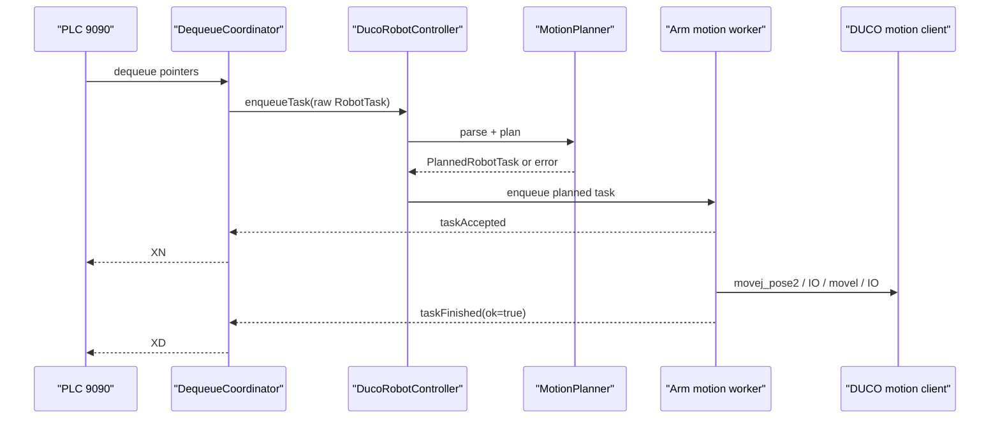

# duco-task-executor design

## 0. 术语约定

| 术语 | 定义 | 防冲突结论 |
|---|---|---|
| ArmPayload | 从 `(flag,count,...)E` 解析出的机械臂 payload | 不等同 `core::RobotTask`，后者仍保留 raw bytes |
| MotionSegment | 与 DUCO 指令一一对应的中立运动段 | 不暴露 `DucoCobot` 类型到 core |
| MotionRecipe | 每个 arm 的速度、工具、工件坐标、IO、字段映射 | full recipe 管理留给 `field-config-and-recipes` |
| Pose6d / Joint6d | DUCO 位姿 6 维和近邻关节 6 维值对象 | roadmap 文件级方案已使用该名 |
| PlannedRobotTask | `RobotTask + QList<MotionSegment>` 的 robot 内部执行形态 | 用来承接 roadmap 4.5 的 segments 契约 |
| DUCO motion worker | 每个 arm 串行执行 motion client 阻塞调用的 worker | 不在 PLC/camera socket 回调里执行 |

## 1. 决策与约束

需求摘要：本 feature 让非默认出队任务从“DUCO 未实现拒绝”变为“解析 payload、生成运动段、用 DUCO motion client 执行”。成功标准是有效任务按 `XN -> DUCO motion -> XD` 闭环，默认空任务仍安全结束，失败任务不会被伪装成正常完成。

明确不做：
- 不修改 PLC `9999/9090` 或相机 legacy/dual camera 外部报文。
- 不恢复旧示教器 `data/1` / `1,count` 机械臂 TCP 协议。
- 不做 Qt HMI、Smart200 Modbus、现场 recipe UI 或完整 recipe 文件管理。
- 不硬编码现场坐标、喷枪 IO、速度、工具坐标系或字段映射。
- 不在默认构建中强制链接真实 DUCO SDK。

复杂度档位偏离：
- 健壮性 = L3：payload、recipe、DUCO 返回值都是外部边界，失败必须可观察且不能误报完成。
- 结构 = layers：core 只知道 `IRobotController` 和 raw `RobotTask`；解析、规划、DUCO 调用留在 robot 层。
- 可测试性 = tested：无 SDK 时用 recording client 验证运动顺序和失败短路。
- 并发 = thread-safe：每个 arm 串行 worker，阻塞 motion 调用不进入 PLC/camera 回调线程。
- 兼容性 = backward-compatible：PLC/相机流程和 fake robot 语义保持兼容。

关键决策：
1. **core task 不直接携带 DUCO 细节**：当前 `RobotTask` 只有 raw `payload`，本 feature 在 robot 层引入 `PlannedRobotTask`，避免 `core` 依赖运动规划和 recipe。
2. **失败不发送正常 `XD`**：当前 `DequeueCoordinator` 忽略 `ok` 会误把失败当完成；本 feature 改为 `taskFinished(ok=false)` 只告警和保留状态，不发 `XD`。不新增 PLC 错误报文字段。
3. **accepted 表示已开始执行**：非默认任务只有在 payload 和 recipe 校验通过、worker 真正开始执行前才 emit `taskAccepted`，从而触发 `XN`。
4. **recipe 缺失即拒绝执行**：现场字段语义未确认时，不允许猜测坐标或 IO；测试可注入最小 recipe 证明规划和 DUCO 调用链。
5. **DUCO API 扩展仍走 seam**：`IDucoClient` 增加 `moveJPose2/moveL/set*DigitalOut`，真实 SDK disabled 时 recording/mock client 可覆盖测试。

假设待 review：
- 本草案采用“失败不回 `XD`”的安全策略；如果现场 PLC 必须收到释放信号，需要另行设计 PLC 错误/人工复位策略。

## 2. 名词与编排

### 2.1 名词层

现状：
- `core::RobotTask` 位于 `src/core/QueueManager.h`，字段为 `armId/count/pointer/payload/defaultNoop`。
- `core::DequeueCoordinator::onTaskFinished()` 当前忽略 `ok/message`，总是 `markTaskDone()` 并发 `XD`。
- `domain::Payloads` 只有默认 payload 格式化和识别，没有解析 `(flag,count,...)E`。
- `DucoRobotController::enqueueTask()` 只支持默认空任务；非默认任务 warning 后 `taskFinished(false)`。
- `IDucoClient` 只有 open/close/heartbeat/power/control/status，没有 motion 和 IO API。

变化：
- 新增 `ArmPayload`：解析 flag、armId、count、原始字段 token、是否默认空任务，并校验 flag arm 与 task arm 一致。
- 新增 `MotionSegment`：`MoveJPose2`、`MoveL`、`ToolDigitalOut`、`StandardDigitalOut` 四类，字段匹配 DUCO 指南中的 `movej_pose2`、`movel`、`set_tool_digital_out`、`set_standard_digital_out`。
- 新增 `MotionRecipe`：最小包含 `tool/wobj/qNear/approachSpeed/lineSpeed/acc/radius/ioKind/ioChannel/fieldMapping`；来源为配置或测试注入。
- 新增 `MotionPlanner`：`RobotTask + MotionRecipe -> PlannedRobotTask`，缺字段或非数值字段时返回错误。
- 扩展 `IDucoClient`：增加 motion/IO 方法；真实 wrapper 只在 `SPRAY_ENABLE_DUCO` 后绑定现场 SDK，默认 unavailable client 仍可编译。

接口示例：

```cpp
// 输入 payload: (1001,123,0.49,0.14,0.44,-1.14,0,-1.57)E
MotionPlanner::plan(task, recipe)
// 输出: MoveJPose2(approach) -> IO on -> MoveL(path point) -> IO off
```

### 2.2 编排层



现状：
- 出队流程已是 `PLC -> QueueManager -> DequeueCoordinator -> IRobotController`。
- DUCO controller 没有 per-arm motion queue；非默认任务不会触发 motion client。
- stop/pause/resume/readStatus 已经通过 control/status role client 执行。

变化：
- `DucoRobotController::enqueueTask()` 对默认空任务保持快速 accepted/finished；对非默认任务走 planner。
- planner 成功后按 arm 投递到串行 worker；同一 arm 不并发执行，arm1/arm2 可各自排队。
- worker 在执行第一条 DUCO 命令前 emit `taskAccepted`；全部 motion/IO 成功后 emit `taskFinished(true)`。
- planner 失败、recipe 缺失、motion client 返回 `-1` 或 stop/pause 引发中断时 emit warning 和 `taskFinished(false)`，不发正常 `XD`。
- `DequeueCoordinator` 使用 `ok` 分支：true 才 mark done + `XD`，false 记录失败事件并保留 cache/queue 状态供人工处理。

流程级约束：
- motion worker 只使用 motion client；stop/pause/resume 继续只使用 control client。
- DUCO `open/prepare` 未成功时禁止规划后的 motion 执行。
- 喷枪 IO 必须成对：开启后若后续 motion 失败，要尝试关闭同一 IO 并记录关闭结果。
- payload 中 count 与 task count 不一致时按错误处理，不继续执行。
- 默认空任务不调用任何 DUCO motion/IO。

### 2.3 挂载点清单

- DUCO seam：`IDucoClient` 新增 motion/IO API，删掉后本 feature 无法调用真实运动。
- Motion planner：新增 payload 解析、recipe 校验、segment 规划入口，删掉后非默认任务不能转运动段。
- DUCO controller 执行队列：新增 per-arm worker 和 planned task 调度，删掉后非默认任务不会执行。
- DequeueCoordinator 完成语义：新增 `ok=false` 不发 `XD` 的分支，删掉后失败会被误报完成。
- 配置/注入入口：提供最小 recipe source，删掉后只能默认拒绝非默认任务。

### 2.4 推进策略

1. 结果语义收紧：让 `DequeueCoordinator` 区分 `taskFinished(ok)`，失败不发 `XD`。
   退出信号：新增失败任务测试证明 `ok=false` 不 mark done、不反馈 `XD`。
2. payload 与 motion 名词：补 `ArmPayload`、`MotionSegment`、`MotionRecipe`、`PlannedRobotTask`。
   退出信号：默认 payload、合法 payload、非法 payload 都有解析/校验结果。
3. planner 计算节点：实现 raw payload + recipe 到 segment 序列的转换。
   退出信号：测试可验证 `movej_pose2 -> IO on -> movel -> IO off` 规划顺序。
4. DUCO seam 扩展：为 motion/IO 增加 client 接口和 recording fake。
   退出信号：无 SDK 构建通过，测试能记录 motion/IO 调用。
5. controller 执行编排：DUCO controller 用 per-arm worker 串行执行 planned task。
   退出信号：默认空任务、有效任务、规划失败、DUCO `-1` 均有信号路径。
6. 回归守护：复跑 PLC、相机、fake robot、DUCO controller 测试。
   退出信号：`spray_tests.exe` 通过，默认构建不依赖现场 SDK。

### 2.5 结构健康度与微重构

##### 评估

- 文件级 — `src/core/DequeueCoordinator.cpp`：约 45 行，职责清晰；本次只收紧 `ok=false` 完成语义。
- 文件级 — `src/robot/duco/DucoRobotController.cpp`：约 223 行，继续塞 planner/worker 会混杂 lifecycle 与 motion 执行。
- 文件级 — `src/domain/Payloads.*`：当前只管 payload helper，适合补解析但不适合放运动规划。
- 目录级 — `src/robot/duco`：已有 6 个文件，DUCO SDK 适配集中；新 motion worker 可落在该目录或 `src/robot/motion`，避免继续膨胀 controller。
- compound convention：未发现目录组织类 decision。

##### 结论：不做预置微重构，但新逻辑落新文件

本 feature 不需要“只搬不改行为”的前置微重构。实现时应把 planner、motion types、worker 放到新文件，`DucoRobotController` 只保留 lifecycle 和任务调度粘合，避免把运动执行直接塞进现有 controller。

##### 超出范围的观察

- `Application.cpp` 已约 331 行，后续 HMI/Modbus 接入前建议另走 `cs-refactor` 抽 service factory；不阻塞本 feature。
- 完整 recipe 文件结构属于 `field-config-and-recipes`，本 feature 只留最小注入/配置挂点。

## 3. 验收契约

关键场景清单：
1. 默认空任务：输入 `(1000,count)E` 或 `(2000,count)E` 出队。
   - 期望：不调用 DUCO motion/IO，仍发 `XN` 后 `XD`。
2. 有效 payload + recipe：输入 arm 匹配、count 匹配、字段足够且数值合法。
   - 期望：worker 发 `XN`，motion client 记录 `movej_pose2 -> IO on -> movel -> IO off`，成功后发 `XD`。
3. 无效 payload：flag arm 不匹配、count 不匹配、字段不足或非数值。
   - 期望：warning，不调用 motion/IO，不发 `XN/XD` 或正常完成。
4. recipe 缺失或禁用：非默认任务没有可用 recipe。
   - 期望：warning，不调用 DUCO，不发 `XD`。
5. DUCO motion 返回 `-1`：任一 motion/IO 失败。
   - 期望：尝试关闭喷枪 IO，emit `taskFinished(false)`，不 mark done，不发 `XD`。
6. stop/pause/resume：运动任务排队或执行中触发控制命令。
   - 期望：命令仍走 control client，不混用 motion client。
7. PLC/相机流程守护：复跑 legacy/dual camera 和 fake robot 闭环。
   - 期望：`9999/9090`、相机 payload 存储、默认策略不变。

明确不做的反向核对项：
- 代码中不应出现旧机械臂 `data` 请求或 `1,count` 完成协议。
- PLC 和相机 socket 回调不应直接 include 或调用 `DucoCobot`。
- 默认构建不应因为缺少现场 DUCO SDK include/lib 失败。
- 本 feature 不应新增 Qt HMI、Modbus 客户端或 recipe UI。

## 4. 与项目级架构文档的关系

acceptance 阶段需要回写：
- `ARCHITECTURE.md` 的 robot 子系统：补入 payload parser、motion planner、per-arm DUCO motion worker。
- `ARCHITECTURE.md` 的队列反馈语义：`taskFinished(ok=false)` 不发送正常 `XD`。
- requirement `duco-task-executor` 从 draft 更新为 current。
- roadmap item `duco-task-executor` 从 in-progress 更新为 done。
