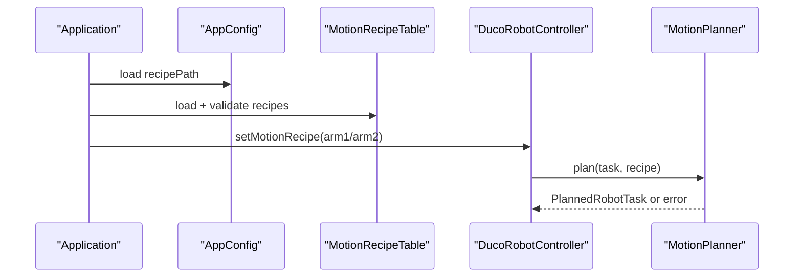

# field-config-and-recipes design

## 0. 术语约定

| 术语 | 定义 | 防冲突结论 |
|---|---|---|
| FieldConfig | 现场配置文件集合，承载 recipe、字段映射和喷枪 IO | 不等同 `AppConfig`，后者仍是进程级配置 |
| MotionRecipeTable | 从配置文件加载并按 armId 查询的 recipe 表 | 参考 `ModbusAddressTable` 的独立配置表模式 |
| MotionRecipe | robot 层执行喷涂的单 arm 配方 | 已存在于 `MotionTypes.h`，本 feature 只补文件化来源 |
| PoseFieldMapping | payload values 中 6 个位姿字段的索引映射 | 对应现有 `MotionRecipe::poseValueIndices` |
| SprayIoConfig | 喷枪 IO 类型和通道配置 | 映射到 `ToolDigitalOut` 或 `StandardDigitalOut` |
| FieldRecipeLoader | 加载并校验现场 recipe 文件的入口 | 不负责生成路径或访问相机/PLC |

## 1. 决策与约束

需求摘要：本 feature 把当前只能测试注入的 `MotionRecipe` 文件化，让现场可以按 arm 配置工具/工件坐标、qNear、字段映射、速度、加速度、圆滑半径和喷枪 IO。成功标准是 DUCO 非默认任务能从配置拿到 recipe，缺失或非法配置明确 warning 并拒绝执行，默认空任务仍安全完成。

明确不做：
- 不修改 PLC `9999/9090`、相机 payload 外部格式或 DUCO motion API。
- 不硬编码真实现场点位、速度、工具坐标系、工件坐标系或喷枪 IO。
- 不做 Qt 配置编辑页面，不做热加载。
- 不做多段路径 DSL、轨迹自动生成或真实硬件逐点验收。
- 不把 recipe 加入 `core::RobotTask`；core 继续只传 raw payload。

复杂度档位偏离：
- 健壮性 = L3：配置来自现场文件，非法值必须在加载或规划前失败，不允许带病执行 motion。
- 安全性 = safety-critical：喷枪 IO 和速度错误可能导致危险动作；默认值只能用于示例，不能假装现场参数有效。
- 兼容性 = backward-compatible：默认 fake/headless 构建和现有 PLC/相机/Modbus 流程不变。
- 可观测性 = logged：recipe 缺失、字段越界、速度非法、IO 非法必须走 warning。
- 可测试性 = tested：加载、校验、注入、缺失 recipe、默认空任务都要有测试。

关键决策：
1. **配置表独立于 AppConfig**：`AppConfig` 只新增 recipe 文件路径；具体 recipe 列表由 `MotionRecipeTable` 加载，避免把复杂数组塞进通用配置解析器。
2. **robot 层拥有 recipe 语义**：字段映射、速度和 IO 转 `MotionRecipe`，不进入 `core`。
3. **Application 只负责装配**：启动时加载 recipe table，并把每个 arm recipe 注入 DUCO controller；不解析字段语义。
4. **缺失 recipe 是运行期拒绝，不是 PLC 协议错误**：非默认任务缺 recipe 时 warning + `taskFinished(false)`；不新增 PLC 错误反馈码。
5. **示例文件不等于现场参数**：仓库只放可测试示例；真实值由现场替换。

前置依赖：`duco-task-executor` 已 done，已有 `MotionRecipe`、`MotionPlanner::plan()` 和 `DucoRobotController::setMotionRecipe()`；`diagnostics-and-logs` 已 done，可记录 recipe warning。

假设：初版 recipe 只覆盖现有最小运动序列 `movej_pose2 -> IO on -> movel -> IO off` 所需参数；多段路径和喷涂工艺曲线后续另起 feature。

## 2. 名词与编排

### 2.1 名词层

现状：
- `src/robot/MotionTypes.h` 已有 `MotionRecipe`，字段包括 `tool/wobj/qNear/poseValueIndices/approachSpeed/lineSpeed/acceleration/radius/sprayIoType/sprayIoChannel`。
- `MotionPlanner::plan(task, recipe)` 已校验 recipe enabled、armId、速度、IO、pose mapping，并生成四段最小运动。
- `DucoRobotController::setMotionRecipe(recipe)` 只能由测试或人工注入；`Application` 不加载 recipe 文件。
- `AppConfig` 没有 recipe 文件路径；`config/` 没有 motion recipe 示例文件。
- `ModbusAddressTable` 已提供“独立表文件 + 校验 + 单测”的相近模式。

变化：
- 新增 `RobotConfig::recipePath`：默认 `config/motion_recipes.toml`，只保存路径。
- 新增 `MotionRecipeTable`：加载 `[[recipes]]`，按 armId 保存 `MotionRecipe`，校验重复 arm、缺失 arm、非法字段映射、非法速度和非法 IO。
- 新增 `FieldRecipeLoader` 或等价静态加载入口：把 TOML-like 文本转成 `MotionRecipeTable`。
- 新增 `config/motion_recipes.toml` 示例：包含 arm1/arm2 示例 recipe，明确标注需要现场替换。
- 扩展 `Application` DUCO 装配：DUCO 模式下加载 recipe table 并调用 `setMotionRecipe()`；fake 模式不依赖 recipe 文件。

接口示例：

```cpp
auto table = MotionRecipeTable::load("config/motion_recipes.toml", &error);
auto recipe = table.recipeForArm(1);
ducoController->setMotionRecipe(*recipe);
```

配置示例：

```toml
[[recipes]]
arm_id = 1
enabled = true
tool = "spray_tool"
wobj = "station"
q_near = [0, 0, 0, 0, 0, 0]
pose_indices = [0, 1, 2, 3, 4, 5]
approach_speed = 0.5
line_speed = 0.25
acceleration = 0.8
radius = 0.01
spray_io = "tool"
spray_io_channel = 2
```

### 2.2 编排层



现状：
- DUCO controller 的 `recipes_` 默认空；非默认任务因 recipe disabled/missing 被拒绝。
- 只有测试 helper `recipeForArm()` 构造 recipe；现场运行无法通过配置改变字段映射或速度。
- 配置解析集中在 `AppConfig`，但当前只处理简单 section/key。

变化：
- `AppConfig::load()` 解析 `[robot] recipe_path`。
- `Application::initialize()` 在 DUCO 模式下加载 `MotionRecipeTable`，把每条 recipe 注入 `DucoRobotController`。
- `MotionRecipeTable::load()` 参考 `ModbusAddressTable` 独立解析，避免让 `AppConfig` 处理数组。
- `MotionPlanner` 继续只消费 `MotionRecipe`，不感知文件格式。

流程级约束：
- fake robot 和默认空任务不要求 recipe 文件。
- DUCO 非默认任务缺 recipe 或 recipe disabled 时不执行 motion，不发送正常完成 `XD`。
- recipe 文件加载失败必须可观察；DUCO 模式应让 initialize/start 失败或发 warning，不能静默忽略。
- `pose_indices` 必须正好 6 个非负索引；执行时超出 payload values 仍由 planner 拒绝。
- `spray_io` 只允许 `tool` / `standard`，通道号必须 > 0。

### 2.3 挂载点清单

- 配置挂载：`[robot] recipe_path` 和 `config/motion_recipes.toml` 示例，删掉后现场 recipe 没有文件来源。
- recipe table 挂载：`MotionRecipeTable` 加载/校验/查询入口，删掉后配置无法变成 `MotionRecipe`。
- Application 装配挂载：DUCO controller 创建后注入 recipes，删掉后运行期仍只能测试注入。
- 测试挂载：新增 recipe table 和 DUCO/Application 注入测试，删掉后配置边界无回归证据。

### 2.4 推进策略

1. 配置路径：扩展 `[robot] recipe_path`，默认指向 `config/motion_recipes.toml`。
   退出信号：`AppConfig` 测试覆盖解析和默认值。
2. recipe table：实现 `MotionRecipeTable` 加载、校验和查询。
   退出信号：测试覆盖合法 arm1/arm2、重复 arm、非法 mapping、非法速度和非法 IO。
3. 示例配置：新增 motion recipes 示例文件。
   退出信号：示例能被 loader 读取，且注释明确现场替换。
4. Application 注入：DUCO 模式加载 recipe table 并注入 controller。
   退出信号：测试证明 configured recipe 能让非默认任务规划，缺失 recipe 仍拒绝。
5. 范围守护：复跑 robot/app/config 测试和协议 grep。
   退出信号：PLC、相机、Modbus、Qt Widgets 行为无变更。

### 2.5 结构健康度与微重构

##### 评估

- 文件级 — `src/config/AppConfig.cpp`：已约 300 行，继续塞复杂 recipe 数组解析会变成通用 TOML parser，应该只加路径字段。
- 文件级 — `src/robot/MotionTypes.h`：当前集中 motion 值对象，新增 table 不应继续塞进该头文件。
- 文件级 — `src/app/Application.cpp`：已承担多设备装配；本次只允许加 recipe 注入薄逻辑，不在其中解析 recipe 文件。
- 目录级 — `src/robot`：已有 motion planner/types 和 duco 子目录，新增 recipe table 仍属于 robot 层，不需要新顶层目录。
- compound convention：`.codestable/compound` 无目录组织类 decision。

##### 结论：不做预置微重构，新职责落新文件

本 feature 不做“只搬不改行为”的微重构。实现时把 recipe 文件解析和校验落到 `src/robot/MotionRecipeTable.*`；`AppConfig` 只加路径，`Application` 只做装配。

##### 超出范围的观察

- `Application.cpp` 已持续变胖，后续 HMI/Modbus/recipe 全部接入后建议另走 `cs-refactor` 抽 service factory 或 `AppContext`。

## 3. 验收契约

关键场景清单：
1. 合法 recipe 文件：包含 arm1/arm2、字段映射、速度和 IO。
   - 期望：loader 返回两个 enabled recipe，可按 arm 查询。
2. 重复 arm：两个 recipe 使用同一 arm_id。
   - 期望：加载失败并提示 duplicate arm。
3. 字段映射非法：`pose_indices` 不是 6 个、含负数或非整数。
   - 期望：加载失败，不进入 DUCO controller。
4. 速度/加速度/IO 非法：速度 <= 0、未知 `spray_io`、通道 <= 0。
   - 期望：加载失败或 planner 拒绝，warning 可观察。
5. DUCO 装配：DUCO 模式下加载 recipe 并注入 controller。
   - 期望：有效 payload + recipe 能规划并执行既有最小 motion 序列。
6. 缺失 recipe：非默认任务没有对应 arm recipe。
   - 期望：warning，`taskFinished(false)`，不发正常 `XD`。
7. 默认空任务：`(1000,0)E` / `(2000,0)E`。
   - 期望：不依赖 recipe，不调用 DUCO motion/IO，仍安全 accepted/finished。

明确不做的反向核对项：
- 不应修改 PLC `9999/9090` 字节格式、反馈码或端口默认值。
- 不应修改相机 legacy/dual camera 外部协议。
- 不应新增 Qt Widgets 配置页面或 HMI 代码。
- 不应把现场 recipe 字段塞进 `core::RobotTask` 或 `QueueManager`。
- 不应硬编码真实现场坐标、速度或喷枪 IO 到 C++ 代码。

## 4. 与项目级架构文档的关系

acceptance 阶段需要回写：
- `ARCHITECTURE.md` 的术语：补入 FieldConfig、MotionRecipeTable、PoseFieldMapping、SprayIoConfig。
- `ARCHITECTURE.md` 的 robot 子系统现状：说明 recipe 文件加载、校验、DUCO 注入和失败边界。
- requirement `field-config-and-recipes` 从 draft 更新为 current。
- roadmap item `field-config-and-recipes` 从 in-progress 更新为 done。
