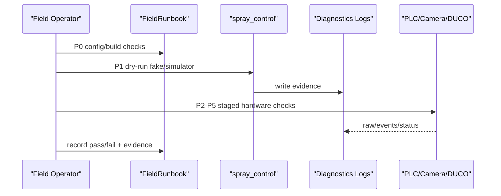

# hardware-acceptance design

## 0. 术语约定

| 术语 | 定义 | 防冲突结论 |
|---|---|---|
| HardwareAcceptance | 真实 PLC、相机、DUCO 机械臂的阶段化现场验收流程 | 不等同单元测试或本地 simulator |
| FieldRunbook | 现场按顺序执行的操作手册 | 面向人工执行，不自动驱动危险动作 |
| FieldChecklist | 每一步 pass/fail/evidence/sign-off 记录表 | 不是 roadmap checklist |
| EvidenceBundle | 验收证据集合：配置快照、日志、测试输出、现场记录 | 不包含现场凭证或私密参数 |
| DryRunGate | 接入真实硬件前必须通过的离线/仿真检查 | 使用 fake robot 和 simulator |
| SafetyHoldPoint | 危险动作前必须人工确认的停止点 | 不能由脚本跳过 |

## 1. 决策与约束

需求摘要：本 feature 为真实硬件联调提供可执行的验收包。成功标准是现场人员可以按阶段确认配置、日志、PLC、相机、DUCO prepare、低速运动和异常回退，并能保存证据；同时不改变 PLC/相机协议、不硬编码现场参数、不让脚本自动执行危险运动。

明确不做：
- 不修改 PLC `9999/9090` 字节格式、反馈码、端口默认值或相机外部协议。
- 不写入真实现场 IP、Smart200 地址、相机字段、喷枪 IO 或机械臂坐标。
- 不实现 Qt HMI 页面或 HMI 交互代码。
- 不提供自动喷涂脚本，不绕过急停、限位、气源、示教器/控制柜安全确认。
- 不替代现场 SDK 安装、网络布线、电气接线和机器人安全验收。

复杂度档位偏离：
- 安全性 = safety-critical：真实机械臂和喷枪动作必须设置人工 hold point。
- 健壮性 = L3：每一步失败都要有定位证据和回退动作。
- 可观测性 = evidence-first：日志、配置快照、测试输出和人工记录是交付物。
- 兼容性 = strict-backward-compatible：验收流程只使用既有协议和配置，不改生产链路。

关键决策：
1. **验收包优先于自动化**：真实硬件动作由人工按 runbook 执行；脚本只做本地检查、dry-run 和证据收集。
2. **分阶段 gate**：配置/构建 -> dry-run -> PLC -> 相机 -> DUCO prepare -> 低速动作 -> 生产观察，后一步不能掩盖前一步失败。
3. **证据统一归档**：每个阶段记录命令、配置文件、日志路径、预期现象、实际结果和操作者签名。
4. **硬件差异留给现场参数**：recipe、IP、端口、Modbus 地址和喷枪接线只在现场配置中替换，不进入仓库默认值。
5. **失败优先停机**：任何 DUCO motion、IO、PLC 反馈或相机入队异常都按安全停止/回退流程处理，不靠继续运行观察。

前置依赖：`duco-task-executor`、`qt-hmi-shell`、`diagnostics-and-logs`、`field-config-and-recipes` 均已 done。

假设：本 feature 只交付验收材料和低风险 helper，不要求当前开发机接入真实硬件；真实通过/失败结果由现场人员填写。

## 2. 名词与编排

### 2.1 名词层

现状：
- `Application` 已支持 `--headless --simulate-robot`、配置加载、PLC/相机 endpoint、DUCO/fake robot 分支。
- `DeviceSimulator` 已能通过公开 TCP 端口复现 PLC 最小闭环和 dual camera 入队。
- `DiagnosticsService`、`RawFrameFileSink` 已能写 raw/events JSONL，并暴露设备健康和事件查询。
- `MotionRecipeTable` 已加载现场 recipe 示例，真实参数由现场替换。
- 当前没有 `docs/` 或现场 runbook；验收步骤散落在 feature acceptance 报告和 roadmap 观察项中。

变化：
- 新增 `FieldRunbook`：描述阶段、前置条件、操作命令、预期现象、失败处理和证据位置。
- 新增 `FieldChecklist`：按 P0-P6 记录 pass/fail、时间、操作者、证据文件和安全 hold point。
- 新增 `EvidenceBundle` 约定：收集 git commit、config 快照、motion recipe、logs、test-output、现场备注。
- 新增低风险 helper：只允许校验文件存在、运行 dry-run/test、复制日志和配置，不允许发真实 motion 命令。

接口示例：

```powershell
.\tools\field_acceptance\collect_evidence.ps1 -RunId "site-20260524-am" -LogDir "logs"
```

输出示例：

```text
out\field-acceptance\site-20260524-am\
  config\
  logs\
  test-output\
  checklist.md
  summary.txt
```

### 2.2 编排层



现状：
- 本地测试能证明软件路径，但不能指导现场按顺序接线、上电、连 PLC/相机/DUCO。
- diagnostics 有日志能力，但没有说明现场何时打开、保存哪些文件、失败时如何截取证据。
- `config/default.toml` 和 `motion_recipes.toml` 是示例，缺少生产替换检查清单。

变化：
- P0 准备：确认构建、SDK、配置文件、recipe、日志持久化、急停/限位/气源/工作区。
- P1 dry-run：使用 fake robot 和 simulator 验证 PLC 出队、dual camera 入队、日志写入。
- P2 PLC：真实 PLC 连 `9999/9090`，验证入队命令、出队指针、`XN/XD` 反馈和异常记录。
- P3 相机：按 legacy 或 dual camera 模式验证触发、READY、2D/3D payload 和 `Done`。
- P4 DUCO prepare：验证网络、open、heartbeat、power_on、enable、status，不执行喷涂路径。
- P5 低速运动：使用现场确认过的低速 recipe 和无料/空喷条件，验证 accepted/finished、IO 开关和失败停机。
- P6 生产观察：短时运行，确认日志、设备健康、队列状态和人工回退路径。

流程级约束：
- 每个 SafetyHoldPoint 后必须人工确认，helper 不能自动继续。
- P5 前必须确认 recipe 是现场替换值，不是仓库示例值。
- 失败证据必须包含 `events.jsonl`、`raw-frames.jsonl`、配置快照和现场备注。
- 真实硬件阶段默认不开 Modbus 写；若后续要写 PLC 数据另起 feature。
- 验收包不修改 `Application` 的运行时行为，不新增 PLC 错误码。

### 2.3 挂载点清单

- runbook 挂载：现场执行入口，删掉后人员没有阶段化操作依据。
- checklist 挂载：现场记录入口，删掉后验收不能形成 pass/fail/evidence 记录。
- evidence helper 挂载：证据收集入口，删掉后仍可手工收集但一致性下降。
- docs/roadmap/req 挂载：把硬件验收边界和后续回写纳入 CodeStable。

### 2.4 推进策略

1. requirement 和 design 初稿：锁定能力边界、阶段 gate、明确不做和安全 hold point。
   退出信号：用户确认 design，可进入 approved。
2. 验收文档：编写 FieldRunbook 和 FieldChecklist。
   退出信号：文档覆盖 P0-P6、每步有前置条件/操作/期望/失败处理/证据。
3. 低风险 helper：实现 evidence 收集脚本或等价命令说明。
   退出信号：脚本只复制配置/日志/test-output，不发真实硬件命令。
4. 范围守护：验证未改 PLC/相机/DUCO motion API，未写真实现场参数，未新增 HMI 代码。
   退出信号：grep 和 YAML/frontmatter 校验通过。

### 2.5 结构健康度与微重构

##### 评估

- 文件级 — `src/app/Application.cpp`：已有变胖趋势，但本 feature 不应继续加运行时逻辑。
- 文件级 — `src/diagnostics/DeviceSimulator.*`：已有本地模拟能力，不应扩成真实硬件控制器。
- 目录级 — 根目录目前没有 `docs/` 或 `tools/field_acceptance/`；新增验收资料属于独立交付物，不应塞进 `src/`。
- compound convention：`.codestable/compound` 暂无目录组织类 decision。

##### 结论：不做代码微重构，新职责落文档/工具目录

本 feature 不做“只搬不改行为”的微重构。真实硬件验收属于现场运行资料和证据收集，不应修改 core/io/robot 编排代码。

##### 超出范围的观察

- `Application.cpp` 后续如果继续挂 HMI/Modbus/验收控制入口，应另走 `cs-refactor` 抽 service factory 或 `AppContext`。
- 真实 DUCO SDK include/lib 和控制器版本仍需现场确认，若接入失败应另走 issue 流程。

## 3. 验收契约

关键场景清单：
1. 准备阶段：用户打开 runbook。
   - 期望：能看到构建、SDK、配置、日志、急停、气源、工作区和 recipe 替换检查项。
2. dry-run 阶段：用户按 runbook 执行 fake/simulator。
   - 期望：能得到 PLC `1N/1D` 或 dual camera `Done` 证据，并记录日志路径。
3. PLC 阶段：真实 PLC 连接 `9999/9090`。
   - 期望：入队/出队/反馈按既有协议可观察；失败时知道保存哪些 raw frame。
4. 相机阶段：legacy 或 dual camera 真实连接。
   - 期望：触发、READY、payload、Done 按配置路径记录；晚到/半包按现有行为处理。
5. DUCO prepare 阶段：连接真实控制器但不执行喷涂路径。
   - 期望：open/heartbeat/power_on/enable/status 成功或失败可见。
6. 低速运动阶段：人工确认后执行低速空喷。
   - 期望：accepted/finished、喷枪 IO、失败停机和不误发 `XD` 均可记录。
7. 证据收集：运行 helper 或手工收集。
   - 期望：形成包含配置、日志、test-output、checklist 的目录。

明确不做的反向核对项：
- 不应修改 PLC `9999/9090` 字节格式、反馈码或端口默认值。
- 不应修改相机 legacy/dual camera 外部协议。
- 不应新增自动执行真实 motion/IO 的脚本。
- 不应提交真实现场 IP、坐标、喷枪 IO、Smart200 地址或凭证。
- 不应新增 Qt Widgets 页面或 HMI 代码。

## 4. 与项目级架构文档的关系

acceptance 阶段需要回写：
- `ARCHITECTURE.md` 的 diagnostics/现场验收现状：补入 FieldRunbook、FieldChecklist、EvidenceBundle。
- `ARCHITECTURE.md` 的硬边界：真实硬件验收 helper 不得自动驱动危险动作，不得写真实现场参数。
- requirement `hardware-acceptance` 从 draft 更新为 current。
- roadmap item `hardware-acceptance` 从 in-progress 更新为 done。
