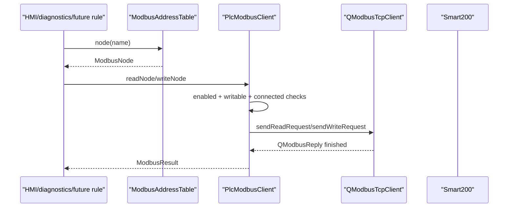

# modbus-plc-reservation design

## 0. 术语约定

| 术语 | 定义 | 防冲突结论 |
|---|---|---|
| PLC TCP 主流程 | 现有 `PlcEndpoint` 的 `9999/9090` 入队、出队、反馈链路 | 本 feature 不修改 |
| Modbus sidecar | 独立于 `PlcEndpoint` 的 Smart200 Modbus TCP 客户端 | 默认禁用，不参与主流程 |
| AddressTable | 配置文件中的 Modbus 节点表 | 禁止把 Smart200 地址硬编码进业务代码 |
| ModbusNode | 一个可读写 PLC 地址定义 | 包含 name、type、slaveId、address、count、writable |
| PlcModbusClient | `io/plc` 下封装 Qt SerialBus 的客户端 | 后续 HMI/规则引擎只能通过它访问 Modbus |
| DisabledResult | Modbus 禁用时返回的可观察错误 | 避免误以为请求已写入 PLC |

## 1. 决策与约束

需求摘要：本 feature 为 Smart200 预留 Modbus TCP 能力。成功标准是项目有清晰的配置、地址表和读写 API 方案，后续实现能默认禁用、不影响 `9999/9090`，并可用 Qt SerialBus 的 `QModbusTcpClient` 实现异步读写。

明确不做：
- 不修改 `PlcEndpoint` 的入队/出队 TCP server 和反馈逻辑。
- 不让 Modbus 写入参与队列、相机或 DUCO 任务触发。
- 不硬编码 Smart200 地址，不假设现场寄存器含义。
- 不做 HMI 页面、不做自动轮询策略、不做业务规则引擎。
- 不在禁用状态下建立 TCP 连接或发任何写请求。

复杂度档位偏离：
- 健壮性 = L3：写 PLC 数据属于现场高风险边界，必须默认禁用、显式授权、错误可见。
- 结构 = layers：Modbus 落在 `io/plc` 旁路模块，不污染 core 队列状态机。
- 可测试性 = tested：无真实 PLC 时用 seam/fake 验证配置、地址表、禁用和请求编排。
- 兼容性 = backward-compatible：原 PLC `9999/9090` 和相机/DUCO 流程保持兼容。
- 可观测性 = logged：连接、读写、超时、协议异常后续都应进入 diagnostics。

关键决策：
1. **默认禁用**：`modbus.enabled=false` 是默认值；禁用时 API 只返回 disabled。
2. **地址表配置化**：所有节点从 `config/modbus_nodes.toml` 或等价文件读取。
3. **Qt SerialBus 可选实现**：默认构建不强制要求本机安装 Qt SerialBus；启用 `SPRAY_ENABLE_MODBUS` 后用 Qt 6 `SerialBus` 组件、`QModbusTcpClient`、`QModbusDataUnit`、`QModbusReply`。
4. **异步边界**：读写请求返回 pending operation 或通过 signal/callback 完成，不阻塞 PLC socket 回调。
5. **写操作显式授权**：`writable=false` 节点拒绝写入；后续 HMI 必须再做确认。

参考依据：Qt 6 文档要求启用 Modbus transport 时 CMake 查找并链接 `Qt6::SerialBus`，`QModbusTcpClient` 通过 `NetworkAddressParameter`、`NetworkPortParameter` 配置 TCP 地址，读写通过异步 `QModbusReply` 完成。本地 Qt 6.10.2 MinGW 未安装 SerialBus，因此默认构建保持关闭。

## 2. 名词与编排

### 2.1 名词层

现状：
- `CMakeLists.txt` 只查找 `Qt6 Core Network Test`，没有可选 `SerialBus` 开关。
- `AppConfig` 只有 `[plc]`、`[queue]`、`[robot]`、`[camera]`、`[logging]`，没有 Modbus 配置。
- `src/io/plc/PlcEndpoint.*` 只负责 `9999/9090` TCP server。
- 当前没有 `src/io/plc/PlcModbusClient.*`，grep 无 `QModbusTcpClient` 代码命中。

变化：
- 新增 `ModbusConfig`：`enabled/host/port/defaultSlaveId/timeoutMs/retries/addressTablePath`。
- 新增 `ModbusNode`：`name/type/slaveId/address/count/writable/description`。
- 新增 `ModbusAddressTable`：负责加载、校验、按 name 查找节点。
- 新增 `ModbusResult` / `ModbusError`：表达 disabled、not connected、timeout、protocol error、permission denied。
- 新增 `PlcModbusClient`：封装 connect、disconnect、read/write API，不暴露 Qt reply 给 core。

建议文件与函数职责：

| 文件 | 函数 | 作用 |
|---|---|---|
| `src/config/AppConfig.h/.cpp` | `ModbusConfig` / parse `[modbus]` | 表达 enabled、host、port、slaveId、timeout、retries、地址表路径 |
| `config/modbus_nodes.toml` | 地址表 | 保存 Smart200 节点定义，默认空表或示例注释 |
| `src/io/plc/ModbusTypes.h` | `ModbusNode` / `ModbusValue` / `ModbusError` | Modbus 中立类型，不暴露 Qt 类给上层 |
| `src/io/plc/ModbusAddressTable.h/.cpp` | `load(path)` / `node(name)` / `validate()` | 加载和校验地址表 |
| `src/io/plc/PlcModbusClient.h/.cpp` | `connectToPlc()` / `disconnectFromPlc()` | 管理 `QModbusTcpClient` 生命周期 |
| `src/io/plc/PlcModbusClient.h/.cpp` | `readHoldingRegisters(slave,start,count)` | 读取保持寄存器 |
| `src/io/plc/PlcModbusClient.h/.cpp` | `writeHoldingRegisters(slave,start,values)` | 写多个保持寄存器 |
| `src/io/plc/PlcModbusClient.h/.cpp` | `writeCoil(slave,address,value)` | 写单个线圈 |
| `src/io/plc/PlcModbusClient.h/.cpp` | `readNode(name)` / `writeNode(name,values)` | 按地址表名称读写，检查 writable |

接口示例：

```cpp
client.readHoldingRegisters(1, 400, 2);
client.writeHoldingRegisters(1, 410, {123, 456});
client.writeCoil(1, 20, true);
```

### 2.2 编排层



现状：
- `Application` 启动 robot、camera、PLC；没有 Modbus 生命周期。
- `PlcEndpoint` 的 socket 回调只处理已有 TCP 主流程。
- 没有地址表、无连接参数、无 Modbus 错误语义。

变化：
- Modbus sidecar 可以被 `Application` 或后续 HMI 单独创建，但默认 disabled 不连接。
- enabled 时才创建/连接 `QModbusTcpClient`，并设置 host、port、timeout、retries。
- 读写请求先查地址表和权限，再发 Qt SerialBus 异步请求。
- 所有完成结果通过 signal/callback 或 pending operation 返回；不阻塞 socket 回调。

流程级约束：
- Modbus 不得调用 `QueueManager`、`DequeueCoordinator` 或 `IRobotController`。
- `PlcEndpoint` 不 include `PlcModbusClient`，避免主流程耦合。
- 写入 `writable=false` 节点直接拒绝，不发网络请求。
- `address/count/slaveId` 必须做范围校验；空地址表不是错误，只代表无可命名节点。
- 协议异常和超时记录为 diagnostics 事件，不能伪装成成功。

### 2.3 挂载点清单

- 构建挂载：CMake 增加 `SPRAY_ENABLE_MODBUS` 和启用后的 `Qt6::SerialBus` 链接，删掉后真实 Modbus transport 无法构建。
- 配置挂载：`AppConfig` 增加 `[modbus]`，删掉后无法表达禁用、连接和地址表路径。
- 地址表挂载：`config/modbus_nodes.toml`，删掉后只能直接地址读写，命名节点消失。
- 客户端挂载：`src/io/plc/PlcModbusClient.*`，删掉后 Modbus API 消失。
- 测试挂载：配置/地址表/禁用/读写编排测试，删掉后无法守住默认禁用和主流程不变。

### 2.4 推进策略

1. 配置契约：补 `ModbusConfig`、默认 disabled、配置解析和校验。
   退出信号：禁用默认值和非法端口/timeout/retry 有测试。
2. 地址表：实现 `ModbusNode`、`ModbusAddressTable` 和示例空表。
   退出信号：合法节点、重复 name、非法地址、不可写节点校验可观察。
3. 客户端 seam：封装可选 `QModbusTcpClient` transport behind interface，保留 fake reply 测试入口。
   退出信号：无真实 PLC 时可测试 disabled/not connected/permission denied。
4. 读写 API：实现 holding registers 和 coil 的异步读写编排。
   退出信号：请求类型、slaveId、address、count、values 可被 fake 记录。
5. 范围守护：复跑 PLC、相机、DUCO/fake 测试并 grep 主流程。
   退出信号：`9999/9090`、相机流程、DUCO 执行路径未变。

### 2.5 结构健康度与微重构

##### 评估

- 文件级 — `src/app/Application.cpp`：已偏胖，本 feature 不应把轮询或地址表细节塞进去。
- 文件级 — `src/io/plc/PlcEndpoint.*`：职责清晰，只管 `9999/9090`；不应合并 Modbus。
- 文件级 — `src/config/AppConfig.*`：已有简单分区 parser，新增 `[modbus]` 属于职责延伸。
- 目录级 — `src/io/plc` 当前文件少，适合新增 `PlcModbusClient` 和 address table 文件。
- compound convention：未发现目录组织类 decision。

##### 结论：不做预置微重构，新逻辑落新文件

本 feature 不需要先搬文件。实现时新增 `PlcModbusClient`、`ModbusTypes`、`ModbusAddressTable`，不要把 Modbus 逻辑并入 `PlcEndpoint`。

##### 超出范围的观察

- 如果后续需要周期轮询大量 PLC 点位，应另起 `diagnostics-and-logs` 或规则引擎 feature 设计节流、去抖和快照缓存。
- `Application.cpp` 的 service factory 抽取仍建议另走 `cs-refactor`，不阻塞本 feature。

## 3. 验收契约

关键场景清单：
1. 默认配置：不写 `[modbus]` 或 `enabled=false`。
   - 期望：不连接 Smart200，调用 API 返回 disabled，`9999/9090` 仍正常。
2. 地址表加载：提供空表、合法节点、重复 name、非法地址。
   - 期望：空表允许；非法表返回可读错误；不硬编码现场地址。
3. 读保持寄存器：调用 `readHoldingRegisters(1, start, count)`。
   - 期望：生成 HoldingRegisters read request，完成后返回 values 或 ModbusError。
4. 写保持寄存器：调用 writable 节点或直接地址写入。
   - 期望：生成 write request；不可写节点拒绝且不发网络请求。
5. 写线圈：调用 `writeCoil(slave,address,value)`。
   - 期望：生成 coil write request，协议错误可观察。
6. 连接异常：host 不可达、timeout、protocol exception。
   - 期望：返回错误并记录 diagnostics，不影响 PLC 主流程。
7. 范围守护：复跑现有测试和 grep。
   - 期望：PLC `9999/9090`、相机、DUCO/fake 行为不变。

明确不做的反向核对项：
- 不应修改 `PlcEndpoint` 的外部协议语义。
- 不应让 Modbus 写入触发队列入队、出队或 DUCO motion。
- 不应在业务代码硬编码 Smart200 地址表。
- 不应新增 HMI 页面或自动轮询业务策略。

## 4. 与项目级架构文档的关系

acceptance 阶段需要回写：
- `ARCHITECTURE.md` 的术语：补入 Modbus sidecar、AddressTable、PlcModbusClient。
- `ARCHITECTURE.md` 的 io 子系统现状：说明 Modbus 默认禁用，不参与 `9999/9090`。
- requirement `modbus-plc-reservation` 从 draft 更新为 current。
- roadmap item `modbus-plc-reservation` 从 in-progress 更新为 done。
