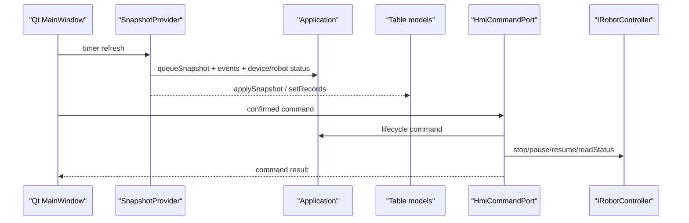

# qt-hmi-shell design

## 0. 术语约定

| 术语 | 定义 | 防冲突结论 |
|---|---|---|
| HMI shell | Qt Widgets 主窗口、导航、页面栈、顶部状态栏 | 当前代码没有 `src/ui`，本 feature 只给方案 |
| SnapshotProvider | UI 周期读取系统状态的中介 | 对齐 roadmap 4.7 的 `SnapshotService`，不直接改队列 |
| SystemSnapshot | 首屏汇总快照，组合队列、设备、机械臂、告警、事件摘要 | 当前仅有 `QueueSnapshot`，需要后续扩展 |
| DeviceSnapshot | PLC、2D、3D、Modbus 等设备连接状态 | 当前端点没有统一 status 契约 |
| RobotSnapshot | arm1/arm2 状态、运行中、最近错误、任务状态 | 来源应是 `IRobotController::readStatus()` |
| HmiCommandPort | UI 发起高层命令的唯一入口 | 不让按钮直接调用 socket、队列容器或 DUCO SDK |
| DangerousCommand | 急停、停止、回安全位等需要确认的命令 | 防止误触现场动作 |

## 1. 决策与约束

需求摘要：本 feature 输出 Qt Widgets HMI 的实现蓝图。成功标准是后续人工或 feature 实现时，能按本方案建立主窗口、页面、表格模型、快照刷新和命令边界，同时不改变 PLC/相机/DUCO 主流程。

明确不做：
- 不生成 Qt UI 源码，不改 `src/`、`tests/`、`CMakeLists.txt`。
- 不修改 PLC `9999/9090`、相机 `9001/9002` 或 legacy 单相机流程。
- 不新增 Modbus 实际读写，不新增 recipe 编辑热更新。
- 不让 UI 直接修改 `QueueManager` 内部队列、缓存或指针。
- 不把旧网页 HMI 或示教器操作协议迁入新项目。

复杂度档位偏离：
- 健壮性 = L3：UI 命令会影响现场设备，危险操作必须确认、记录、失败可见。
- 结构 = layers：UI 只依赖快照和 command port；通讯、队列、运动仍由 app/core/io/robot 承担。
- 可测试性 = reviewable：本轮是设计产物；后续实现再补 model/command 单元测试和 headless 回归。
- 兼容性 = backward-compatible：`--headless --simulate-robot` 必须继续可用。
- 可观测性 = visible：日志、告警、设备状态必须能进入页面，不依赖控制台滚屏。

关键决策：
1. **Qt Widgets 作为 HMI 方案**：工业现场界面优先使用稳定、紧凑、可键鼠操作的 Widgets，不做营销式页面。
2. **快照只读，命令单向**：页面按 500-1000 ms 读取快照；按钮只向 `HmiCommandPort` 发送命令。
3. **首屏就是操作总览**：启动 GUI 后直接进入总览页，不做 landing page。
4. **headless 与 GUI 分支并存**：后续实现时 `--headless` 继续走 `QCoreApplication`；GUI 分支才创建 `QApplication/MainWindow`。
5. **危险命令二次确认**：急停、停止、回安全位、配置保存等必须有确认、结果反馈和事件日志。

## 2. 名词与编排

### 2.1 名词层

现状：
- `src/app/main.cpp` 固定创建 `QCoreApplication`，虽然解析 `--headless`，但当前没有 GUI 分支。
- `src/app/Application.h` 只暴露 `queueSnapshot()` 和 `events()`，没有 `SystemSnapshot`。
- `src/domain/Snapshots.h` 只有 `QueueItemSnapshot`、`CacheSnapshot`、`QueueSnapshot`。
- `src/diagnostics/EventLog.*` 可返回事件记录，尚无 UI model。
- `src/robot/IRobotController.h` 已有 `stop/pause/resume/readStatus`，可作为 HMI 命令与状态基础。
- 当前没有 `src/ui` 目录，CMake 只查找 `Qt6 Core Network Test`。

变化：
- 设计 `SystemSnapshot`：包含运行状态、`QueueSnapshot`、设备快照、arm1/arm2 机械臂快照、告警和事件摘要。
- 设计 `DeviceSnapshot`：包含设备名、host/port、online、连接数、最近收发时间、最近错误、启用状态。
- 设计 `RobotSnapshot`：包含 armId、连接/使能/运动状态、当前 count/pointer、最近任务结果、最近错误。
- 设计 `HmiCommandPort`：包装 start/stop/emergency/pause/resume/readStatus/readPose/safeHome/configValidate 等高层命令。
- 设计表格模型：队列表、缓存表、事件日志表只消费 snapshot 或 event records。

建议文件与函数职责：

| 文件 | 函数 | 作用 |
|---|---|---|
| `src/ui/MainWindow.h/.cpp` | `setupUi()` | 创建顶部状态栏、左侧导航、页面栈和全局按钮 |
| `src/ui/MainWindow.h/.cpp` | `bindViewModels()` | 绑定 `SnapshotProvider`、table model 和页面刷新 |
| `src/ui/MainWindow.h/.cpp` | `refreshTopStatus(SystemSnapshot)` | 刷新运行、PLC、2D、3D、arm1、arm2、Modbus 状态灯 |
| `src/ui/MainWindow.h/.cpp` | `wireCommands()` | 把按钮连接到 `HmiCommandPort`，危险命令走确认 |
| `src/ui/SnapshotProvider.h/.cpp` | `start(intervalMs)` / `stop()` | 控制 UI 定时刷新，默认 500-1000 ms |
| `src/ui/SnapshotProvider.h/.cpp` | `buildSystemSnapshot()` | 从 `Application` 汇总 queue/events/device/robot 快照 |
| `src/ui/HmiCommandPort.h/.cpp` | `startSystem()` / `stopSystem()` | 发起主控启动/停止，后续不得绕过 `Application` 生命周期 |
| `src/ui/HmiCommandPort.h/.cpp` | `emergencyStop()` | 触发 robot stop 和安全事件记录，必须二次确认 |
| `src/ui/HmiCommandPort.h/.cpp` | `pauseArm()` / `resumeArm()` / `stopArm()` | arm 级任务控制，映射到 `IRobotController` 控制命令 |
| `src/ui/models/QueueTableModel.h/.cpp` | `rowCount()` / `columnCount()` / `data()` | 展示主队列、arm 队列和缓存字段 |
| `src/ui/models/QueueTableModel.h/.cpp` | `applySnapshot(QueueSnapshot)` | 用只读快照刷新表格，不访问队列容器 |
| `src/ui/models/EventLogModel.h/.cpp` | `setRecords()` / `append()` | 展示事件历史和新增事件 |
| `src/ui/models/EventLogModel.h/.cpp` | `setFilter(filter)` | 按设备、等级、count、pointer 过滤日志 |
| `src/ui/pages/OverviewPage.h/.cpp` | `refresh(SystemSnapshot)` | 展示流程总览、当前任务、告警、关键设备状态 |
| `src/ui/pages/QueuePage.h/.cpp` | `refresh(QueueSnapshot)` | 展示主队列、arm1/arm2 明细、发送缓存 |
| `src/ui/pages/DevicePage.h/.cpp` | `refresh(SystemSnapshot)` | 展示 PLC、相机、robot、Modbus 连接和最近 IO |
| `src/ui/pages/RobotControlPage.h/.cpp` | `refresh(RobotSnapshot)` | 展示单臂状态和控制按钮可用性 |
| `src/ui/pages/ConfigPage.h/.cpp` | `loadConfig()` / `validatePendingConfig()` | 加载配置并做保存前校验，不热更新关键安全参数 |
| `src/ui/pages/LogsPage.h/.cpp` | `refreshLogs()` / `exportLogs()` | 查看和导出分类日志，支持 hex/text 显示 |

### 2.2 编排层

现状：
- `Application::start()` 启动 robot、camera、PLC；`Application::stop()` 按 robot、camera、PLC 关闭。
- `EventLog` 已接收 PLC raw、camera raw、robot warning/status、queue enqueue/dequeue 等事件。
- robot 控制命令已存在，但没有 UI command facade。

变化：
- GUI 分支创建 `MainWindow`，MainWindow 不持有协议端点和队列写接口。
- `SnapshotProvider` 定时取快照并推给 model/page；UI 线程只做展示。
- `HmiCommandPort` 统一接收按钮命令，负责确认结果、错误消息和事件记录。
- 页面刷新采用稳定尺寸和紧凑布局，避免状态变化导致表格和按钮跳动。

流程级约束：
- UI 定时刷新不得阻塞 PLC/camera socket 回调或 robot worker。
- 命令按钮必须根据快照状态禁用不合法动作。
- 日志页默认显示业务事件；原始通讯日志后续由 diagnostics 文件日志补齐。
- 配置页只做校验和待保存提示，不在运行中热更新端口、DUCO IP、危险 recipe 参数。

### 2.3 挂载点清单

- 应用入口：后续在 `main.cpp` 增加 `QApplication/MainWindow` 分支，删掉后 GUI 消失。
- UI 模块：后续新增 `src/ui`、`src/ui/models`、`src/ui/pages`，删掉后界面消失。
- 快照契约：后续扩展 `domain/Snapshots.h` 和 `Application` snapshot facade，删掉后 UI 没有数据源。
- 命令契约：后续新增 `HmiCommandPort`，删掉后按钮无法安全操作系统。
- 构建挂载：后续 CMake 查找/link `Qt6::Widgets`，删掉后 GUI 目标无法构建。

### 2.4 后续实现推进策略

1. 快照契约先行：补 `SystemSnapshot/DeviceSnapshot/RobotSnapshot` 和只读 provider。
   退出信号：无 UI 时也能单测构造快照。
2. 命令边界：建立 `HmiCommandPort`，只包装已有生命周期和 robot 控制能力。
   退出信号：危险命令有确认、结果和日志。
3. UI 壳：建立 `MainWindow`、顶部状态栏、左侧导航、页面栈。
   退出信号：GUI 启动后首屏为总览页，headless 仍可启动。
4. 模型与页面：实现队列表、事件日志表、总览/队列/设备/机器人/配置/日志页。
   退出信号：快照变化不会改变表格列宽和按钮布局。
5. 回归守护：复跑 headless、PLC、相机、DUCO/fake 测试。
   退出信号：外部通讯流程与 `XN/XD` 语义无变化。

### 2.5 结构健康度与微重构

##### 评估

- 文件级 — `src/app/Application.cpp`：已承担服务创建、生命周期和事件 wiring；HMI 实现不应继续把 UI 逻辑塞进该文件。
- 文件级 — `src/app/main.cpp`：当前固定 `QCoreApplication`，后续只适合放 GUI/headless 分支选择，不适合承载界面创建细节。
- 文件级 — `src/domain/Snapshots.h`：当前只有队列快照，适合补轻量快照结构，但不适合放 UI model。
- 目录级 — 当前没有 `src/ui`，后续应直接按 `ui/models`、`ui/pages` 建目录，避免摊平。
- compound convention：未发现目录组织类 decision。

##### 结论：本轮不做微重构

本 feature 是设计蓝图，不改代码。本轮不做“只搬不改行为”的微重构。后续实现时，UI 逻辑应落在 `src/ui`，`Application` 只暴露快照和命令必要入口。

##### 超出范围的观察

- `Application.cpp` 后续接入 HMI 和 Modbus 前，建议单独评估 service factory 或 `AppContext` 抽取；这属于 `cs-refactor`，不阻塞本界面方案。

## 3. 验收契约

关键场景清单：
1. 设计产物：打开本 design。
   - 期望：能看到页面结构、快照模型、命令边界、建议文件和函数职责。
2. GUI 首屏：后续用非 headless 启动。
   - 期望：首屏是系统总览，显示运行、PLC、相机、arm、Modbus 状态，不出现营销式 landing page。
3. headless 守护：后续用 `spray_control --headless --simulate-robot` 启动。
   - 期望：不创建 Widgets，仍监听 PLC `9999/9090`。
4. 队列展示：PLC 入队、相机数据写入、PLC 出队指针变化。
   - 期望：队列表和缓存表只通过 snapshot 展示 count/pointer/status/source。
5. 危险命令：点击急停、停止、回安全位。
   - 期望：必须二次确认，命令经 `HmiCommandPort`，事件日志记录结果。
6. 配置页：修改端口、DUCO IP、recipe 或 Modbus 地址。
   - 期望：只校验和提示重启/停机后生效，不运行中热更新危险参数。
7. 反向核对：本 item 完成后检查工作区。
   - 期望：只新增/修改 `.codestable` 文档，不改动 `src/`、`tests/`、`CMakeLists.txt`。

明确不做的反向核对项：
- 不应出现新增 `QWidget/QMainWindow` 源码。
- 不应新增 `QModbusTcpClient` 实际调用。
- 不应修改 PLC、相机、DUCO 执行路径。
- 不应让 UI 直接写 `QueueManager` 容器。

## 4. 与项目级架构文档的关系

本 feature 只输出设计方案，不改变当前代码现状，因此不回写 `ARCHITECTURE.md` 的“当前现状”。后续真正实现 Qt HMI 并验收后，再把 `src/ui`、快照契约和 command port 写入 architecture。

本轮需要回写 roadmap item：`qt-hmi-shell` 从 `planned` 进入 `in-progress`，feature 指向 `2026-05-24-qt-hmi-shell`。
